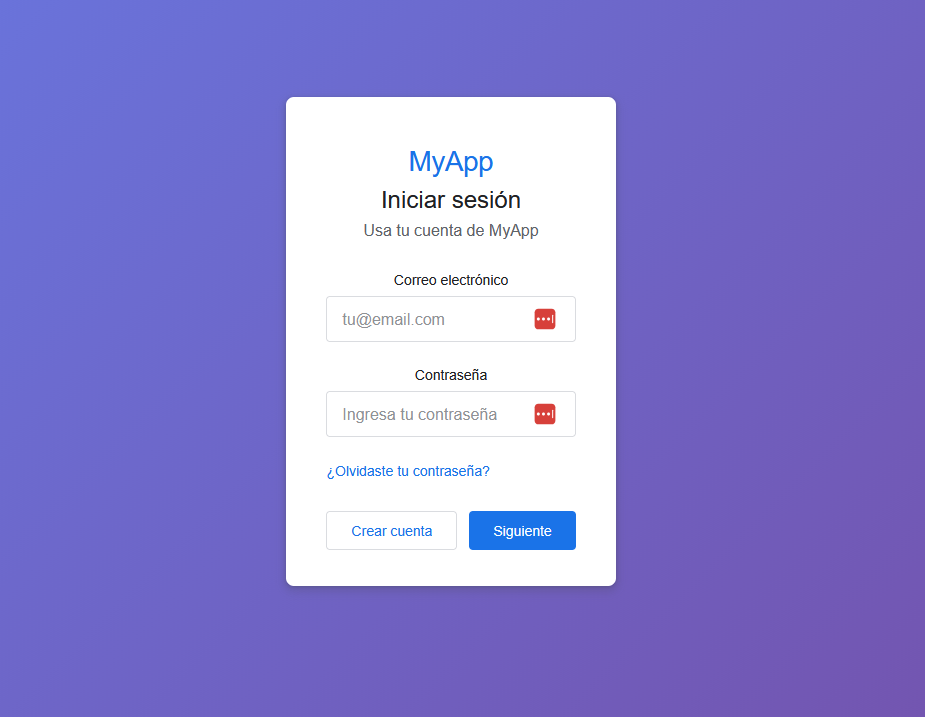

# Componente Login Responsivo (Estilo Google)

En este documento crearemos un componente de Login moderno y responsivo inspirado en Google. Lo haremos en **dos partes**:

1. **Parte A**: HTML + CSS puro (estructura y diseño)
2. **Parte B**: Conversión a React con interactividad

---

## PARTE A: HTML + CSS Puro

### Preparación: ¿Dónde crear los archivos?

Antes de empezar, crea una carpeta temporal fuera del proyecto React para probar el HTML puro:

```bash
# en Gibash, crear carpeta temporal para HTML puro en escritorio en otra terminal
cd $HOME/Desktop
mkdir login-html-puro
cd login-html-puro
```

**Estructura que crearemos:**
```
login-html-puro/
├── login.html  (Paso 1)
└── login.css   (Paso 2)
```

**Cómo visualizarlo en el navegador:**

Después de crear los archivos, podrás abrirlos de 3 formas:

1. **Doble clic (Windows)**: Haz doble clic en `login.html`
2. **Desde navegador**: Abre Chrome/Firefox → `Ctrl + O` → Selecciona `login.html`
3. **Live Server (VSCode)**: Click derecho en `login.html` → "Open with Live Server"

---

### Paso 1: Crear el archivo HTML base

Crear archivo `login.html` con el siguiente contenido:

```html
<!DOCTYPE html>
<html lang="es">
<head>
  <meta charset="UTF-8">
  <meta name="viewport" content="width=device-width, initial-scale=1.0">
  <title>Login - Estilo Google</title>
  <link rel="stylesheet" href="login.css">
</head>
<body>
  <!-- main: contenido principal de la página -->
  <main class="login-container">
    <!-- section: sección temática de login -->
    <section class="login-card">
      <!-- header: encabezado de la sección -->
      <header class="login-header">
        <h1 class="logo">MyApp</h1>
        <h2 class="subtitle">Iniciar sesión</h2>
        <p class="description">Usa tu cuenta de MyApp</p>
      </header>

      <!-- Formulario -->
      <form class="login-form">
        <!-- Email Input -->
        <div class="form-group">
          <label for="email" class="form-label">Correo electrónico</label>
          <input
            type="email"
            id="email"
            name="email"
            class="form-input"
            placeholder="tu@email.com"
          />
          <span class="error-message">Ingresa un correo válido</span>
        </div>

        <!-- Password Input -->
        <div class="form-group">
          <label for="password" class="form-label">Contraseña</label>
          <input
            type="password"
            id="password"
            name="password"
            class="form-input"
            placeholder="Ingresa tu contraseña"
          />
          <span class="error-message">La contraseña debe tener al menos 6 caracteres</span>
        </div>

        <!-- Forgot Password Link -->
        <div class="forgot-password">
          <a href="#" class="link">¿Olvidaste tu contraseña?</a>
        </div>

        <!-- Buttons -->
        <div class="form-actions">
          <button type="button" class="btn-secondary">Crear cuenta</button>
          <button type="submit" class="btn-primary">Siguiente</button>
        </div>
      </form>

      <!-- Loading Spinner (hidden by default) -->
      <div class="loading-spinner" style="display: none;">
        <div class="spinner"></div>
        <p>Iniciando sesión...</p>
      </div>

      <!-- Success Message (hidden by default) -->
      <div class="success-message" style="display: none;">
        <svg class="success-icon" viewBox="0 0 24 24">
          <path d="M9 16.17L4.83 12l-1.42 1.41L9 19 21 7l-1.41-1.41z"/>
        </svg>
        <p>¡Inicio de sesión exitoso!</p>
      </div>
    </section>
  </main>
</body>
</html>
```

### Paso 2: Crear los estilos CSS (login.css)

```css
/* Reset y variables */
* {
  margin: 0;
  padding: 0;
  box-sizing: border-box;
}

:root {
  --primary-color: #1a73e8;
  --primary-hover: #1765cc;
  --error-color: #d93025;
  --success-color: #1e8e3e;
  --text-primary: #202124;
  --text-secondary: #5f6368;
  --border-color: #dadce0;
  --background: #fff;
  --shadow: 0 1px 3px 0 rgba(60, 64, 67, 0.3),
             0 4px 8px 3px rgba(60, 64, 67, 0.15);
}

body {
  font-family: 'Roboto', 'Arial', sans-serif;
  background: linear-gradient(135deg, #667eea 0%, #764ba2 100%);
  min-height: 100vh;
  display: flex;
  align-items: center;
  justify-content: center;
  padding: 20px;
}

/* Contenedor principal */
.login-container {
  width: 100%;
  max-width: 450px;
  animation: fadeIn 0.5s ease-in-out;
}

@keyframes fadeIn {
  from {
    opacity: 0;
    transform: translateY(-20px);
  }
  to {
    opacity: 1;
    transform: translateY(0);
  }
}

/* Card del login */
.login-card {
  background: var(--background);
  border-radius: 8px;
  padding: 48px 40px 36px;
  box-shadow: var(--shadow);
  position: relative;
}

/* Header */
.login-header {
  text-align: center;
  margin-bottom: 32px;
}

.logo {
  color: var(--primary-color);
  font-size: 28px;
  font-weight: 500;
  margin-bottom: 8px;
  letter-spacing: -0.5px;
}

.subtitle {
  color: var(--text-primary);
  font-size: 24px;
  font-weight: 400;
  margin-bottom: 8px;
}

.description {
  color: var(--text-secondary);
  font-size: 16px;
  font-weight: 400;
}

/* Formulario */
.login-form {
  display: flex;
  flex-direction: column;
  gap: 24px;
}

.form-group {
  position: relative;
}

.form-label {
  display: block;
  color: var(--text-primary);
  font-size: 14px;
  font-weight: 500;
  margin-bottom: 8px;
}

.form-input {
  width: 100%;
  padding: 13px 15px;
  font-size: 16px;
  border: 1px solid var(--border-color);
  border-radius: 4px;
  transition: all 0.2s ease;
  font-family: inherit;
  color: var(--text-primary);
}

.form-input:focus {
  outline: none;
  border-color: var(--primary-color);
  box-shadow: 0 0 0 3px rgba(26, 115, 232, 0.1);
}

.form-input::placeholder {
  color: var(--text-secondary);
  opacity: 0.7;
}

/* Estados de error */
.form-group.error .form-input {
  border-color: var(--error-color);
}

.form-group.error .form-input:focus {
  box-shadow: 0 0 0 3px rgba(217, 48, 37, 0.1);
}

.error-message {
  display: none;
  color: var(--error-color);
  font-size: 12px;
  margin-top: 6px;
  font-weight: 400;
}

.form-group.error .error-message {
  display: block;
}

/* Forgot password link */
.forgot-password {
  text-align: left;
}

.link {
  color: var(--primary-color);
  text-decoration: none;
  font-size: 14px;
  font-weight: 500;
  transition: color 0.2s ease;
}

.link:hover {
  color: var(--primary-hover);
  text-decoration: underline;
}

/* Botones */
.form-actions {
  display: flex;
  justify-content: space-between;
  gap: 12px;
  margin-top: 8px;
}

.btn-primary,
.btn-secondary {
  padding: 10px 24px;
  font-size: 14px;
  font-weight: 500;
  border-radius: 4px;
  border: none;
  cursor: pointer;
  transition: all 0.2s ease;
  font-family: inherit;
}

.btn-primary {
  background-color: var(--primary-color);
  color: white;
  flex: 1;
}

.btn-primary:hover {
  background-color: var(--primary-hover);
  box-shadow: 0 1px 2px 0 rgba(60, 64, 67, 0.3),
              0 1px 3px 1px rgba(60, 64, 67, 0.15);
}

.btn-primary:active {
  background-color: #1557b0;
}

.btn-secondary {
  background-color: transparent;
  color: var(--primary-color);
  border: 1px solid var(--border-color);
}

.btn-secondary:hover {
  background-color: rgba(26, 115, 232, 0.04);
  border-color: var(--primary-color);
}

/* Loading spinner */
.loading-spinner {
  text-align: center;
  padding: 40px 0;
}

.spinner {
  width: 48px;
  height: 48px;
  border: 4px solid rgba(26, 115, 232, 0.2);
  border-top-color: var(--primary-color);
  border-radius: 50%;
  margin: 0 auto 16px;
  animation: spin 0.8s linear infinite;
}

@keyframes spin {
  to {
    transform: rotate(360deg);
  }
}

.loading-spinner p {
  color: var(--text-secondary);
  font-size: 14px;
}

/* Success message */
.success-message {
  text-align: center;
  padding: 40px 0;
}

.success-icon {
  width: 64px;
  height: 64px;
  fill: var(--success-color);
  margin-bottom: 16px;
}

.success-message p {
  color: var(--success-color);
  font-size: 16px;
  font-weight: 500;
}

/* Responsive */
@media (max-width: 480px) {
  .login-card {
    padding: 32px 24px 24px;
  }

  .logo {
    font-size: 24px;
  }

  .subtitle {
    font-size: 20px;
  }

  .form-actions {
    flex-direction: column-reverse;
  }

  .btn-primary,
  .btn-secondary {
    width: 100%;
  }
}
```

---

### Visualiza el resultado

Ahora abre `login.html` en tu navegador (doble clic o las opciones mencionadas arriba).

**Qué verás:**
- Fondo degradado morado
- Card blanco centrado con sombra
- Inputs con animaciones de foco
- Botones con efectos hover
- Diseño responsivo (prueba redimensionar la ventana)

**Nota:** Este HTML es solo visual, los botones no hacen nada todavía. En la Parte B lo convertiremos a React con funcionalidad real.

---

## PARTE B: Conversión a React

Ahora vamos a transformar este HTML en un componente React funcional con estados y validaciones.

### Paso 1: Crear el componente Login.jsx

Crear archivo: `src/components/Login.jsx`

**Nota:** Por ahora NO importaremos el CSS, lo haremos en el Paso 3 después de crearlo.

```javascript
import React, { useState } from 'react';

function Login() {
  // Estados para los inputs
  const [email, setEmail] = useState('');
  const [password, setPassword] = useState('');

  // Estados para validaciones
  const [emailError, setEmailError] = useState(false);
  const [passwordError, setPasswordError] = useState(false);

  // Estados para el flujo de la aplicación
  const [isLoading, setIsLoading] = useState(false);
  const [isSuccess, setIsSuccess] = useState(false);

  // Validación de email
  const validateEmail = (email) => {
    // Regex para validar formato de email
    // Puedes crear y probar regex en: https://regex101.com/
    const emailRegex = /^[^\s@]+@[^\s@]+\.[^\s@]+$/;
    return emailRegex.test(email);
  };

  // Validación de password
  const validatePassword = (password) => {
    return password.length >= 6;
  };

  // Manejador de cambio en email
  const handleEmailChange = (e) => {
    const value = e.target.value;
    setEmail(value);

    // Quitar error si el usuario empieza a escribir
    if (emailError && value !== '') {
      setEmailError(false);
    }
  };

  // Manejador de cambio en password
  const handlePasswordChange = (e) => {
    const value = e.target.value;
    setPassword(value);

    // Quitar error si el usuario empieza a escribir
    if (passwordError && value !== '') {
      setPasswordError(false);
    }
  };

  // Manejador de envío del formulario
  const handleSubmit = (e) => {
    e.preventDefault();

    // Validar campos
    const isEmailValid = validateEmail(email);
    const isPasswordValid = validatePassword(password);

    setEmailError(!isEmailValid);
    setPasswordError(!isPasswordValid);

    // Si hay errores, no continuar
    if (!isEmailValid || !isPasswordValid) {
      return;
    }

    // Simular proceso de login
    setIsLoading(true);

    // Simulación de API call (2 segundos)
    setTimeout(() => {
      setIsLoading(false);
      setIsSuccess(true);

      console.log('Login exitoso:', { email, password });

      // Limpiar formulario después de 2 segundos
      setTimeout(() => {
        setEmail('');
        setPassword('');
        setIsSuccess(false);
      }, 2000);
    }, 2000);
  };

  // Manejador para "Crear cuenta"
  const handleCreateAccount = () => {
    alert('Redirigiendo a página de registro...');
  };

  return (
    <main className="login-container">
      <section className="login-card">
        {/* Header */}
        <header className="login-header">
          <h1 className="logo">MyApp</h1>
          <h2 className="subtitle">Iniciar sesión</h2>
          <p className="description">Usa tu cuenta de MyApp</p>
        </header>

        {/* Formulario - mostrar solo si no está loading ni success */}
        {!isLoading && !isSuccess && (
          <form className="login-form" onSubmit={handleSubmit}>
            {/* Email Input */}
            <div className={`form-group ${emailError ? 'error' : ''}`}>
              <label htmlFor="email" className="form-label">
                Correo electrónico
              </label>
              <input
                type="email"
                id="email"
                name="email"
                className="form-input"
                placeholder="tu@email.com"
                value={email}
                onChange={handleEmailChange}
                data-testid="email-input"
              />
              <span className="error-message">
                Ingresa un correo válido
              </span>
            </div>

            {/* Password Input */}
            <div className={`form-group ${passwordError ? 'error' : ''}`}>
              <label htmlFor="password" className="form-label">
                Contraseña
              </label>
              <input
                type="password"
                id="password"
                name="password"
                className="form-input"
                placeholder="Ingresa tu contraseña"
                value={password}
                onChange={handlePasswordChange}
                data-testid="password-input"
              />
              <span className="error-message">
                La contraseña debe tener al menos 6 caracteres
              </span>
            </div>

            {/* Forgot Password Link */}
            <div className="forgot-password">
              <a href="#" className="link">
                ¿Olvidaste tu contraseña?
              </a>
            </div>

            {/* Buttons */}
            <div className="form-actions">
              <button
                type="button"
                className="btn-secondary"
                onClick={handleCreateAccount}
                data-testid="create-account-btn"
              >
                Crear cuenta
              </button>
              <button
                type="submit"
                className="btn-primary"
                data-testid="submit-btn"
              >
                Siguiente
              </button>
            </div>
          </form>
        )}

        {/* Loading Spinner */}
        {isLoading && (
          <div className="loading-spinner" data-testid="loading-spinner">
            <div className="spinner"></div>
            <p>Iniciando sesión...</p>
          </div>
        )}

        {/* Success Message */}
        {isSuccess && (
          <div className="success-message" data-testid="success-message">
            <svg className="success-icon" viewBox="0 0 24 24">
              <path d="M9 16.17L4.83 12l-1.42 1.41L9 19 21 7l-1.41-1.41z" />
            </svg>
            <p>¡Inicio de sesión exitoso!</p>
          </div>
        )}
      </section>
    </main>
  );
}

export default Login;
```

### Paso 2: Crear los estilos Login.css

Crear archivo: `src/components/Login.css` con el siguiente contenido:

```css
/* Reset y variables */
* {
  margin: 0;
  padding: 0;
  box-sizing: border-box;
}

:root {
  --primary-color: #1a73e8;
  --primary-hover: #1765cc;
  --error-color: #d93025;
  --success-color: #1e8e3e;
  --text-primary: #202124;
  --text-secondary: #5f6368;
  --border-color: #dadce0;
  --background: #fff;
  --shadow: 0 1px 3px 0 rgba(60, 64, 67, 0.3),
             0 4px 8px 3px rgba(60, 64, 67, 0.15);
}

body {
  font-family: 'Roboto', 'Arial', sans-serif;
  background: linear-gradient(135deg, #667eea 0%, #764ba2 100%);
  min-height: 100vh;
  display: flex;
  align-items: center;
  justify-content: center;
  padding: 20px;
}

/* Contenedor principal */
.login-container {
  width: 100%;
  max-width: 450px;
  animation: fadeIn 0.5s ease-in-out;
}

@keyframes fadeIn {
  from {
    opacity: 0;
    transform: translateY(-20px);
  }
  to {
    opacity: 1;
    transform: translateY(0);
  }
}

/* Card del login */
.login-card {
  background: var(--background);
  border-radius: 8px;
  padding: 48px 40px 36px;
  box-shadow: var(--shadow);
  position: relative;
}

/* Header */
.login-header {
  text-align: center;
  margin-bottom: 32px;
}

.logo {
  color: var(--primary-color);
  font-size: 28px;
  font-weight: 500;
  margin-bottom: 8px;
  letter-spacing: -0.5px;
}

.subtitle {
  color: var(--text-primary);
  font-size: 24px;
  font-weight: 400;
  margin-bottom: 8px;
}

.description {
  color: var(--text-secondary);
  font-size: 16px;
  font-weight: 400;
}

/* Formulario */
.login-form {
  display: flex;
  flex-direction: column;
  gap: 24px;
}

.form-group {
  position: relative;
}

.form-label {
  display: block;
  color: var(--text-primary);
  font-size: 14px;
  font-weight: 500;
  margin-bottom: 8px;
}

.form-input {
  width: 100%;
  padding: 13px 15px;
  font-size: 16px;
  border: 1px solid var(--border-color);
  border-radius: 4px;
  transition: all 0.2s ease;
  font-family: inherit;
  color: var(--text-primary);
}

.form-input:focus {
  outline: none;
  border-color: var(--primary-color);
  box-shadow: 0 0 0 3px rgba(26, 115, 232, 0.1);
}

.form-input::placeholder {
  color: var(--text-secondary);
  opacity: 0.7;
}

/* Estados de error */
.form-group.error .form-input {
  border-color: var(--error-color);
}

.form-group.error .form-input:focus {
  box-shadow: 0 0 0 3px rgba(217, 48, 37, 0.1);
}

.error-message {
  display: none;
  color: var(--error-color);
  font-size: 12px;
  margin-top: 6px;
  font-weight: 400;
}

.form-group.error .error-message {
  display: block;
}

/* Forgot password link */
.forgot-password {
  text-align: left;
}

.link {
  color: var(--primary-color);
  text-decoration: none;
  font-size: 14px;
  font-weight: 500;
  transition: color 0.2s ease;
}

.link:hover {
  color: var(--primary-hover);
  text-decoration: underline;
}

/* Botones */
.form-actions {
  display: flex;
  justify-content: space-between;
  gap: 12px;
  margin-top: 8px;
}

.btn-primary,
.btn-secondary {
  padding: 10px 24px;
  font-size: 14px;
  font-weight: 500;
  border-radius: 4px;
  border: none;
  cursor: pointer;
  transition: all 0.2s ease;
  font-family: inherit;
}

.btn-primary {
  background-color: var(--primary-color);
  color: white;
  flex: 1;
}

.btn-primary:hover {
  background-color: var(--primary-hover);
  box-shadow: 0 1px 2px 0 rgba(60, 64, 67, 0.3),
              0 1px 3px 1px rgba(60, 64, 67, 0.15);
}

.btn-primary:active {
  background-color: #1557b0;
}

.btn-secondary {
  background-color: transparent;
  color: var(--primary-color);
  border: 1px solid var(--border-color);
}

.btn-secondary:hover {
  background-color: rgba(26, 115, 232, 0.04);
  border-color: var(--primary-color);
}

/* Loading spinner */
.loading-spinner {
  text-align: center;
  padding: 40px 0;
}

.spinner {
  width: 48px;
  height: 48px;
  border: 4px solid rgba(26, 115, 232, 0.2);
  border-top-color: var(--primary-color);
  border-radius: 50%;
  margin: 0 auto 16px;
  animation: spin 0.8s linear infinite;
}

@keyframes spin {
  to {
    transform: rotate(360deg);
  }
}

.loading-spinner p {
  color: var(--text-secondary);
  font-size: 14px;
}

/* Success message */
.success-message {
  text-align: center;
  padding: 40px 0;
}

.success-icon {
  width: 64px;
  height: 64px;
  fill: var(--success-color);
  margin-bottom: 16px;
}

.success-message p {
  color: var(--success-color);
  font-size: 16px;
  font-weight: 500;
}

/* Responsive */
@media (max-width: 480px) {
  .login-card {
    padding: 32px 24px 24px;
  }

  .logo {
    font-size: 24px;
  }

  .subtitle {
    font-size: 20px;
  }

  .form-actions {
    flex-direction: column-reverse;
  }

  .btn-primary,
  .btn-secondary {
    width: 100%;
  }
}
```

### Paso 3: Importar el CSS en Login.jsx

Ahora que ya creaste `Login.css`, vuelve a abrir `src/components/Login.jsx` y agrega el import del CSS en la segunda línea:

```javascript
import React, { useState } from 'react';
import './Login.css';  // ← AGREGAR ESTA LÍNEA

function Login() {
  // ... resto del código
```

### Paso 4: Integrar el componente en App.jsx

Editar `src/App.jsx`:

```javascript
import React from 'react';
import Login from './components/Login.jsx';
import './App.css';

function App() {
  return (
    <div className="App">
      <Login />
    </div>
  );
}

export default App;
```

### Paso 5: Ajustar App.css (opcional)

Editar `src/App.css` para limpiar estilos por defecto:

```css
.App {
  min-height: 100vh;
  display: flex;
  align-items: center;
  justify-content: center;
}
```

---

## Diferencias HTML vs React (JSX)

### 1. Atributos de clase
```html
<!-- HTML -->
<div class="login-card">

<!-- React/JSX -->
<div className="login-card">
```

### 2. Labels con for
```html
<!-- HTML -->
<label for="email">

<!-- React/JSX -->
<label htmlFor="email">
```

### 3. Atributos inline
```html
<!-- HTML -->
<div style="display: none;">

<!-- React/JSX -->
<div style={{ display: 'none' }}>
```

### 4. Eventos
```html
<!-- HTML -->
<button onclick="handleClick()">

<!-- React/JSX -->
<button onClick={handleClick}>
```

### 5. Valores controlados
```html
<!-- HTML (no controlado) -->
<input type="email" id="email">

<!-- React (controlado) -->
<input
  type="email"
  value={email}
  onChange={handleEmailChange}
/>
```

---

## Funcionalidades del Componente React

### Estados (useState)
- `email`: Valor del input de email
- `password`: Valor del input de password
- `emailError`: Bandera para mostrar error de email
- `passwordError`: Bandera para mostrar error de password
- `isLoading`: Bandera para mostrar spinner de carga
- `isSuccess`: Bandera para mostrar mensaje de éxito

### Validaciones

**Email**: Usa una expresión regular (regex) para validar el formato:
```javascript
/^[^\s@]+@[^\s@]+\.[^\s@]+$/
```
- `^` - Inicio de la cadena
- `[^\s@]+` - Uno o más caracteres que NO sean espacio ni @
- `@` - Arroba literal
- `[^\s@]+` - Uno o más caracteres que NO sean espacio ni @
- `\.` - Punto literal
- `[^\s@]+` - Uno o más caracteres que NO sean espacio ni @
- `$` - Fin de la cadena

**Herramienta recomendada:** [regex101.com](https://regex101.com/) - para crear y probar expresiones regulares con explicaciones visuales.

**Password**: Mínimo 6 caracteres
```javascript
password.length >= 6
```

### Flujo de interacción
1. Usuario escribe email y password
2. Al hacer submit, valida ambos campos
3. Si hay errores, muestra mensajes (clases CSS dinámicas)
4. Si todo es correcto, muestra loading spinner
5. Después de 2 segundos, muestra mensaje de éxito
6. Se resetea el formulario

### Atributos data-testid
Estos atributos son para facilitar los tests (lo veremos en el siguiente documento):
- `data-testid="email-input"`
- `data-testid="password-input"`
- `data-testid="submit-btn"`
- `data-testid="loading-spinner"`
- `data-testid="success-message"`

---

## Probar el Componente

```bash
# Asegúrate de estar en login-app/
cd login-app

# Instalar dependencias (si no lo has hecho)
npm install

# Iniciar servidor de desarrollo
npm start
```

Abre el navegador en `http://localhost:3000` y verás el login funcionando.



### Pruebas manuales:
1. Intenta enviar sin llenar campos → verás errores
2. Escribe un email inválido → error de email
3. Escribe password de menos de 6 caracteres → error de password
4. Completa correctamente → verás loading y luego success

---

## Resumen

En este documento aprendiste:

1. ✓ Crear un login con HTML + CSS puro (estructura y diseño)
2. ✓ Convertir HTML a React JSX
3. ✓ Usar useState para manejar estados
4. ✓ Implementar validaciones en tiempo real
5. ✓ Mostrar mensajes de error dinámicamente
6. ✓ Simular flujo de autenticación (loading/success)
7. ✓ Diferencias entre HTML y JSX
8. ✓ Diseño responsivo (mobile-first)

**Siguiente paso:** En el documento `03-pruebas-unitarias.md` escribiremos tests con Jasmine y Karma para validar todas estas funcionalidades.
