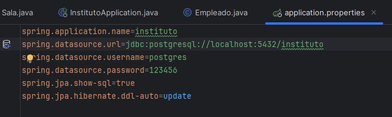
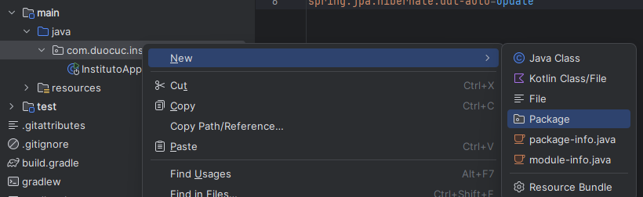
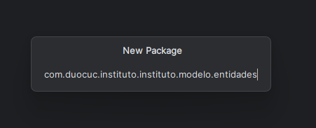
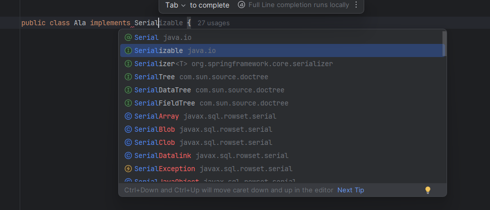
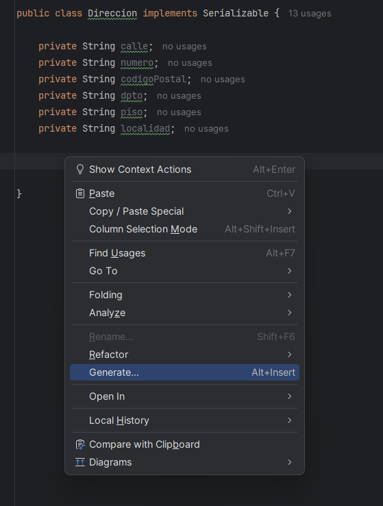
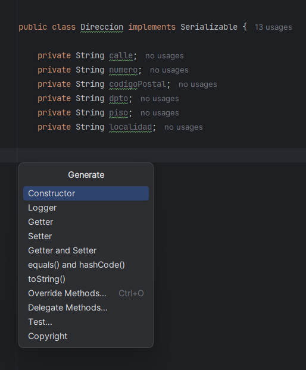
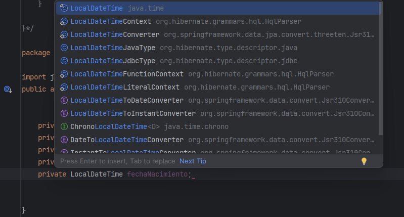

> **Nota:** El codigo final de esta seccion esta disponible en `documentation/parte2_final`. Recuerda agregar las referencias de paquetes correspondientes a tu proyecto (package e imports).

## Antes de empezar

Antes de configurar cualquier cosa en nuestro proyecto Spring Boot, debemos entender el archivo de configuracion principal: `application.properties`.


### Propiedades principales



*Vista del archivo application.properties en el proyecto*

```properties
spring.application.name=instituto
spring.datasource.url=jdbc:postgresql://localhost:5432/instituto
spring.datasource.username=postgres
spring.datasource.password=123456
spring.jpa.show-sql=true
spring.jpa.hibernate.ddl-auto=update
```

#### Explicacion de cada propiedad:

| Propiedad | Descripcion |
|-----------|-------------|
| `spring.application.name` | Nombre de la aplicacion. Se usa para identificarla en logs y monitoreo |
| `spring.datasource.url` | URL de conexion a la base de datos. Formato: `jdbc:postgresql://host:puerto/nombre_db` |
| `spring.datasource.username` | Usuario para conectarse a PostgreSQL |
| `spring.datasource.password` | Contrasena del usuario de la base de datos |
| `spring.jpa.show-sql` | Si es `true`, muestra las consultas SQL generadas en la consola (util para debug) |
| `spring.jpa.hibernate.ddl-auto` | Estrategia de generacion del esquema. `update` actualiza las tablas sin borrar datos |

#### Valores de ddl-auto:

- **none**: No hace nada con el esquema
- **validate**: Valida que el esquema coincida con las entidades
- **update**: Actualiza el esquema sin perder datos (recomendado para desarrollo)
- **create**: Crea el esquema, destruyendo datos previos
- **create-drop**: Crea al iniciar y elimina al cerrar la aplicacion


---

## Creacion del paquete de modelos

Antes de crear nuestras entidades, debemos crear el paquete donde viviran nuestros modelos. Vamos a crear la estructura `modelo.entidades` donde definiremos todas las clases que representan las tablas de nuestra base de datos.



*Ubicacion donde crear el paquete*



*Nombre del paquete: modelo.entidades*

Nuestra primera entidad sera **Ala**, que representa una seccion del instituto.


## 1. Entidad Ala

Segun las reglas de negocio, un ala representa una seccion del instituto que contiene:
- cantidad de pisos
- nombre

Ademas, cada entidad debe contar con un id propio y fechas de alta y modificacion.

### Declaracion de la clase

La clase debe implementar Serializable para permitir la conversion del objeto a bytes, util para cache y sesiones.

```java
public class Ala implements Serializable
```

importar la libreria Serializable de `java.io`



*seleccionar Serializable de java.io*

**Fuentes:**
- [Serializable - Oracle Java Documentation](https://docs.oracle.com/en/java/javase/21/docs/api/java.base/java/io/Serializable.html)
- [Spring Boot JPA Entities](https://docs.spring.io/spring-data/jpa/reference/jpa/entity-persistence.html)

### Atributos

```java
private Integer id;
private Integer cantidadPisos;
private String nombre;
private LocalDateTime fechaAlta;
private LocalDateTime fechaModificacion;
```

## 2. Entidad Direccion

Segun las reglas de negocio, una direccion contiene:
- calle
- numero
- piso
- departamento
- codigo postal
- localidad

### Declaracion de la clase

La clase debe implementar Serializable, importar la libreria de `java.io`

```java
public class Direccion implements Serializable
```

### Atributos

```java
private String calle;
private String numero;
private String codigoPostal;
private String departamento;
private String piso;
private String localidad;
```

### Constructores

recuerden sus clases de POO, constructor sobrecargado es cuando tenemos mas de un constructor, en este caso uno vacio y otro con parametros, que es lo que vamos a crear.

para generar los constructores, click derecho en el codigo > Generate



*opcion Generate en el menu contextual*

seleccionar la opcion Constructor



*seleccionar Constructor del menu*

primero crear el constructor vacio (sin parametros):

```java
public Direccion() {
}
```

luego crear el constructor con todos los parametros, seleccionando todos los atributos:

```java
public Direccion(String calle, String numero, String codigoPostal, String departamento, String piso, String localidad) {
    this.calle = calle;
    this.numero = numero;
    this.codigoPostal = codigoPostal;
    this.departamento = departamento;
    this.piso = piso;
    this.localidad = localidad;
}
```

### Getters y Setters

generar los getters y setters usando Generate > Getter and Setter, seleccionando todos los atributos:

```java
public String getCalle() {
    return calle;
}

public void setCalle(String calle) {
    this.calle = calle;
}

public String getNumero() {
    return numero;
}

public void setNumero(String numero) {
    this.numero = numero;
}

public String getCodigoPostal() {
    return codigoPostal;
}

public void setCodigoPostal(String codigoPostal) {
    this.codigoPostal = codigoPostal;
}

public String getDepartamento() {
    return departamento;
}

public void setDepartamento(String departamento) {
    this.departamento = departamento;
}

public String getPiso() {
    return piso;
}

public void setPiso(String piso) {
    this.piso = piso;
}

public String getLocalidad() {
    return localidad;
}

public void setLocalidad(String localidad) {
    this.localidad = localidad;
}
```

### toString

recuerden de sus clases de POO que un toString sin nada devuelve la direccion de la memoria virtual de java.

generar el toString usando Generate > toString(), seleccionando todos los atributos:

```java
@Override
public String toString() {
    return "Direccion{" +
            "calle='" + calle + '\'' +
            ", numero='" + numero + '\'' +
            ", codigoPostal='" + codigoPostal + '\'' +
            ", departamento='" + departamento + '\'' +
            ", piso='" + piso + '\'' +
            ", localidad='" + localidad + '\'' +
            '}';
}
```

## 3. Entidad Persona

segun las reglas de negocio, persona es la clase padre de alumno, profesor y empleado. contiene:
- nombre
- apellido
- rut
- direccion

ademas, cada entidad debe contar con un id propio y fechas de alta y modificacion.

### Declaracion de la clase

la clase debe ser abstracta porque no se instanciara directamente, solo sus clases hijas. debe implementar Serializable, importar la libreria de `java.io`

```java
public abstract class Persona implements Serializable {
```

### Atributos

```java
private Integer id;
private String nombre;
private String apellido;
private String rut;
private LocalDateTime fechaAlta;
private LocalDateTime fechaModificacion;
private Direccion direccion;
```

importar la libreria LocalDateTime de `java.time`



*seleccionar LocalDateTime de java.time*

### Constructores

generar los constructores usando Generate > Constructor

primero crear el constructor vacio (sin parametros):

```java
public Persona() {
}
```

luego crear el constructor con parametros (sin fechaAlta ni fechaModificacion, ya que se establecen automaticamente):

```java
public Persona(Integer id, String nombre, String apellido, String rut, Direccion direccion) {
    this.id = id;
    this.nombre = nombre;
    this.apellido = apellido;
    this.rut = rut;
    this.direccion = direccion;
}
```

### Getters y Setters

generar los getters y setters usando Generate > Getter and Setter, seleccionando todos los atributos:

```java
public Integer getId() {
    return id;
}

public void setId(Integer id) {
    this.id = id;
}

public String getNombre() {
    return nombre;
}

public void setNombre(String nombre) {
    this.nombre = nombre;
}

public String getApellido() {
    return apellido;
}

public void setApellido(String apellido) {
    this.apellido = apellido;
}

public String getRut() {
    return rut;
}

public void setRut(String rut) {
    this.rut = rut;
}

public LocalDateTime getFechaAlta() {
    return fechaAlta;
}

public void setFechaAlta(LocalDateTime fechaAlta) {
    this.fechaAlta = fechaAlta;
}

public LocalDateTime getFechaModificacion() {
    return fechaModificacion;
}

public void setFechaModificacion(LocalDateTime fechaModificacion) {
    this.fechaModificacion = fechaModificacion;
}

public Direccion getDireccion() {
    return direccion;
}

public void setDireccion(Direccion direccion) {
    this.direccion = direccion;
}
```

### toString

generar el toString usando Generate > toString(), seleccionando todos los atributos:

```java
@Override
public String toString() {
    return "Persona{" +
            "id=" + id +
            ", nombre='" + nombre + '\'' +
            ", apellido='" + apellido + '\'' +
            ", rut='" + rut + '\'' +
            ", fechaAlta=" + fechaAlta +
            ", fechaModificacion=" + fechaModificacion +
            ", direccion=" + direccion +
            '}';
}
```

### equals y hashCode

equals y hashCode son metodos que permiten comparar objetos. equals compara si dos objetos son iguales basandose en sus atributos. por ejemplo, dos personas con el mismo id y rut se consideran iguales. hashCode genera un codigo numerico para el objeto. esto es util cuando queremos agregar personas a un HashSet y evitar duplicados, o cuando usamos personas como claves en un HashMap.

generar equals y hashCode usando Generate > equals() and hashCode(), seleccionando id y rut como atributos de comparacion:

```java
@Override
public boolean equals(Object o) {
    if (this == o) return true;
    if (o == null || getClass() != o.getClass()) return false;
    Persona persona = (Persona) o;
    return id.equals(persona.id) && rut.equals(persona.rut);
}

@Override
public int hashCode() {
    return Objects.hash(id, rut);
}
```

importar la clase Objects de `java.util` para usar el metodo hash()

## 4. Entidad Alumno

segun las reglas de negocio, un alumno hereda de persona y no tiene atributos adicionales.

### Declaracion de la clase

la clase extiende de Persona. recordar que Persona es abstracta y no puede ser instanciada, solo sus clases hijas.

```java
public class Alumno extends Persona {
```

### Constructores

constructor vacio:

```java
public Alumno() {
}
```

constructor con sobrecarga usando super() para llamar al constructor de la clase padre:

```java
public Alumno(Integer id, String nombre, String apellido, String rut, Direccion direccion) {
    super(id, nombre, apellido, rut, direccion);
}
```

## 5. Entidad Profesor

segun las reglas de negocio, un profesor hereda de persona y tiene un sueldo.

### Por que usamos BigDecimal para el sueldo

cuando trabajamos con dinero, no usamos double o float porque tienen errores de precision. por ejemplo, 0.1 + 0.2 con double da 0.30000000000000004 en lugar de 0.3. BigDecimal nos da precision exacta para calculos monetarios.

### Declaracion de la clase

```java
public class Profesor extends Persona {
```

### Atributos

```java
private BigDecimal sueldo;
```

importar BigDecimal de `java.math`

### Constructores

constructor vacio:

```java
public Profesor() {
}
```

constructor con sobrecarga:

```java
public Profesor(Integer id, String nombre, String apellido, String rut, Direccion direccion, BigDecimal sueldo) {
    super(id, nombre, apellido, rut, direccion);
    this.sueldo = sueldo;
}
```

### Getters y Setters

```java
public BigDecimal getSueldo() {
    return sueldo;
}

public void setSueldo(BigDecimal sueldo) {
    this.sueldo = sueldo;
}
```

## 6. Entidad Empleado

segun las reglas de negocio, un empleado hereda de persona y tiene un sueldo, igual que el profesor.

### Declaracion de la clase

```java
public class Empleado extends Persona {
```

### Atributos

```java
private BigDecimal sueldo;
```

importar BigDecimal de `java.math`

## 7. Enumerador TipoEmpleado

segun las reglas de negocio, un empleado tiene un tipo: administrativo o mantenimiento. usamos un enum para definir estos valores fijos, asi evitamos errores de tipeo y el compilador valida que solo uses estos valores. las constantes en java se escriben en mayusculas por convencion.

crear la clase TipoEmpleado en el paquete enumeradores (click derecho en entidades > New > Package > enumeradores):

```java
package com.duoc.institutio.instituto_backend.modelo.entidades.enumeradores;

public enum TipoEmpleado {

    ADMINISTRATIVO,
    MANTENIMIENTO

}
```

## 8. Empleado - Continuacion

ahora completamos la entidad empleado agregando el atributo tipo y sus constructores y metodos.

### Atributos

agregamos el atributo tipo usando el enum TipoEmpleado:

```java
private BigDecimal sueldo;
private TipoEmpleado tipo;
```

importar TipoEmpleado del paquete enumeradores

### Constructores

constructor vacio:

```java
public Empleado() {
}
```

constructor con sobrecarga:

```java
public Empleado(Integer id, String nombre, String apellido, String rut, Direccion direccion, BigDecimal sueldo, TipoEmpleado tipo) {
    super(id, nombre, apellido, rut, direccion);
    this.sueldo = sueldo;
    this.tipo = tipo;
}
```

### Getters y Setters

```java
public BigDecimal getSueldo() {
    return sueldo;
}

public void setSueldo(BigDecimal sueldo) {
    this.sueldo = sueldo;
}

public TipoEmpleado getTipo() {
    return tipo;
}

public void setTipo(TipoEmpleado tipo) {
    this.tipo = tipo;
}
```

## 9. Enumerador TipoPizarra

segun las reglas de negocio, una sala tiene un tipo de pizarra que puede ser digital o normal. en duoc hay pizarras digitales que son mas modernas y pizarras normales. para esto usamos un enum que representa un conjunto fijo de constantes.

crear la clase en el paquete enumeradores:

```java
package com.duoc.institutio.instituto_backend.modelo.entidades.enumeradores;

public enum TipoPizarra {

    DIGITAL,
    NORMAL

}
```

## 10. Entidad Sala

segun las reglas de negocio, una sala contiene numero, tamanio, cantidad de escritorios y tipo de pizarra.

### Declaracion de la clase

```java
public class Sala implements Serializable {
```

### Atributos

```java
private Integer id;
private Integer numero;
private String tamanio;
private Integer cantidadEscritorios;
private TipoPizarra tipoPizarra;
private LocalDateTime fechaAlta;
private LocalDateTime fechaModificacion;
```

importar TipoPizarra del paquete enumeradores

### Constructores

constructor vacio:

```java
public Sala() {
}
```

constructor con parametros:

```java
public Sala(Integer id, Integer numero, String tamanio, Integer cantidadEscritorios, TipoPizarra tipoPizarra) {
    this.id = id;
    this.numero = numero;
    this.tamanio = tamanio;
    this.cantidadEscritorios = cantidadEscritorios;
    this.tipoPizarra = tipoPizarra;
}
```

### Getters y Setters

generar los getters y setters usando Generate > Getter and Setter, seleccionando todos los atributos:

```java
public Integer getId() {
    return id;
}

public void setId(Integer id) {
    this.id = id;
}

public Integer getNumero() {
    return numero;
}

public void setNumero(Integer numero) {
    this.numero = numero;
}

public String getTamanio() {
    return tamanio;
}

public void setTamanio(String tamanio) {
    this.tamanio = tamanio;
}

public Integer getCantidadEscritorios() {
    return cantidadEscritorios;
}

public void setCantidadEscritorios(Integer cantidadEscritorios) {
    this.cantidadEscritorios = cantidadEscritorios;
}

public TipoPizarra getTipoPizarra() {
    return tipoPizarra;
}

public void setTipoPizarra(TipoPizarra tipoPizarra) {
    this.tipoPizarra = tipoPizarra;
}

public LocalDateTime getFechaAlta() {
    return fechaAlta;
}

public void setFechaAlta(LocalDateTime fechaAlta) {
    this.fechaAlta = fechaAlta;
}

public LocalDateTime getFechaModificacion() {
    return fechaModificacion;
}

public void setFechaModificacion(LocalDateTime fechaModificacion) {
    this.fechaModificacion = fechaModificacion;
}
```

### toString

generar el toString usando Generate > toString(), seleccionando todos los atributos:

```java
@Override
public String toString() {
    return "Sala{" +
            "id=" + id +
            ", numero=" + numero +
            ", tamanio='" + tamanio + '\'' +
            ", cantidadEscritorios=" + cantidadEscritorios +
            ", tipoPizarra=" + tipoPizarra +
            ", fechaAlta=" + fechaAlta +
            ", fechaModificacion=" + fechaModificacion +
            '}';
}
```

### equals y hashCode

generar equals y hashCode usando Generate > equals() and hashCode(), seleccionando id y numero como atributos de comparacion:

```java
@Override
public boolean equals(Object o) {
    if (this == o) return true;
    if (o == null || getClass() != o.getClass()) return false;
    Sala sala = (Sala) o;
    return id.equals(sala.id) && numero.equals(sala.numero);
}

@Override
public int hashCode() {
    return Objects.hash(id, numero);
}
```

importar la clase Objects de `java.util`

## 11. Entidad Carrera

segun las reglas de negocio, una carrera contiene nombre, cantidad de materias y cantidad de años estimados.

### Declaracion de la clase

```java
public class Carrera implements Serializable {
```

### Atributos

```java
private Integer id;
private String nombre;
private Integer cantidadMaterias;
private Integer cantidadAnios;
private LocalDateTime fechaAlta;
private LocalDateTime fechaModificacion;
```

### Constructores

constructor vacio:

```java
public Carrera() {
}
```

constructor con sobrecarga:

```java
public Carrera(Integer id, String nombre, Integer cantidadMaterias, Integer cantidadAnios) {
    this.id = id;
    this.nombre = nombre;
    this.cantidadMaterias = cantidadMaterias;
    this.cantidadAnios = cantidadAnios;
}
```

### Getters y Setters

```java
public Integer getId() {
    return id;
}

public void setId(Integer id) {
    this.id = id;
}

public String getNombre() {
    return nombre;
}

public void setNombre(String nombre) {
    this.nombre = nombre;
}

public Integer getCantidadMaterias() {
    return cantidadMaterias;
}

public void setCantidadMaterias(Integer cantidadMaterias) {
    this.cantidadMaterias = cantidadMaterias;
}

public Integer getCantidadAnios() {
    return cantidadAnios;
}

public void setCantidadAnios(Integer cantidadAnios) {
    this.cantidadAnios = cantidadAnios;
}

public LocalDateTime getFechaAlta() {
    return fechaAlta;
}

public void setFechaAlta(LocalDateTime fechaAlta) {
    this.fechaAlta = fechaAlta;
}

public LocalDateTime getFechaModificacion() {
    return fechaModificacion;
}

public void setFechaModificacion(LocalDateTime fechaModificacion) {
    this.fechaModificacion = fechaModificacion;
}
```

### toString

```java
@Override
public String toString() {
    return "Carrera{" +
            "id=" + id +
            ", nombre='" + nombre + '\'' +
            ", cantidadMaterias=" + cantidadMaterias +
            ", cantidadAnios=" + cantidadAnios +
            ", fechaAlta=" + fechaAlta +
            ", fechaModificacion=" + fechaModificacion +
            '}';
}
```

### equals y hashCode

```java
@Override
public boolean equals(Object o) {
    if (this == o) return true;
    if (o == null || getClass() != o.getClass()) return false;
    Carrera carrera = (Carrera) o;
    return id.equals(carrera.id) && nombre.equals(carrera.nombre);
}

@Override
public int hashCode() {
    return Objects.hash(id, nombre);
}
```

importar la clase Objects de `java.util`

## 12. Ala - Continuacion

ahora completamos la entidad ala que ya habiamos empezado.

### Constructores

constructor vacio:

```java
public Ala() {
}
```

constructor con sobrecarga:

```java
public Ala(Integer id, Integer cantidadPisos, String nombre) {
    this.id = id;
    this.cantidadPisos = cantidadPisos;
    this.nombre = nombre;
}
```

### Getters y Setters

```java
public Integer getId() {
    return id;
}

public void setId(Integer id) {
    this.id = id;
}

public Integer getCantidadPisos() {
    return cantidadPisos;
}

public void setCantidadPisos(Integer cantidadPisos) {
    this.cantidadPisos = cantidadPisos;
}

public String getNombre() {
    return nombre;
}

public void setNombre(String nombre) {
    this.nombre = nombre;
}

public LocalDateTime getFechaAlta() {
    return fechaAlta;
}

public void setFechaAlta(LocalDateTime fechaAlta) {
    this.fechaAlta = fechaAlta;
}

public LocalDateTime getFechaModificacion() {
    return fechaModificacion;
}

public void setFechaModificacion(LocalDateTime fechaModificacion) {
    this.fechaModificacion = fechaModificacion;
}
```

### toString

```java
@Override
public String toString() {
    return "Ala{" +
            "id=" + id +
            ", cantidadPisos=" + cantidadPisos +
            ", nombre='" + nombre + '\'' +
            ", fechaAlta=" + fechaAlta +
            ", fechaModificacion=" + fechaModificacion +
            '}';
}
```

### equals y hashCode

```java
@Override
public boolean equals(Object o) {
    if (this == o) return true;
    if (o == null || getClass() != o.getClass()) return false;
    Ala ala = (Ala) o;
    return id.equals(ala.id) && nombre.equals(ala.nombre);
}

@Override
public int hashCode() {
    return Objects.hash(id, nombre);
}
```

importar la clase Objects de `java.util`
