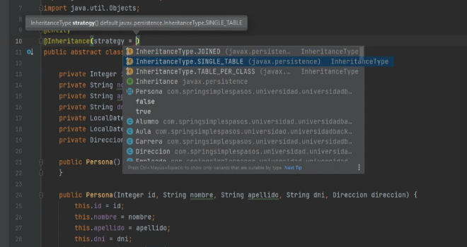
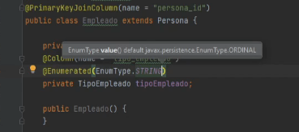
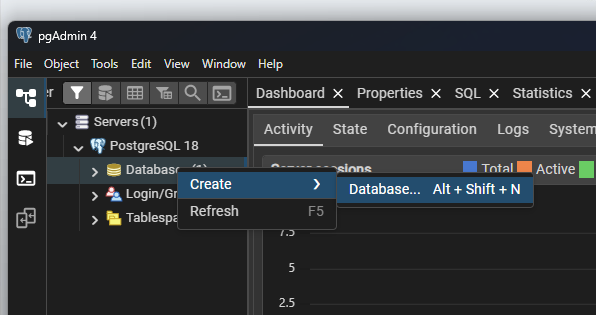
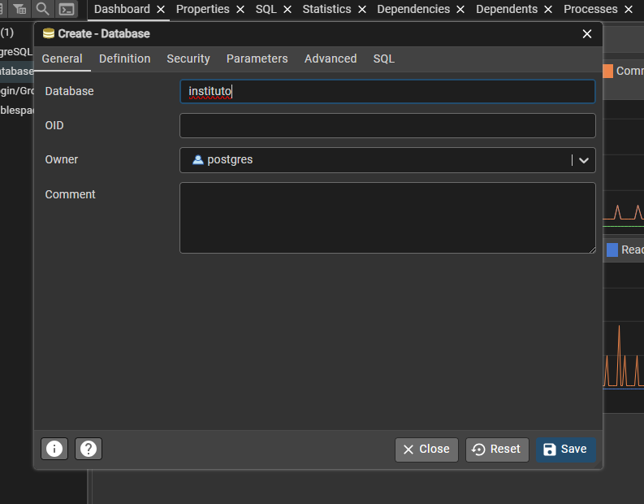
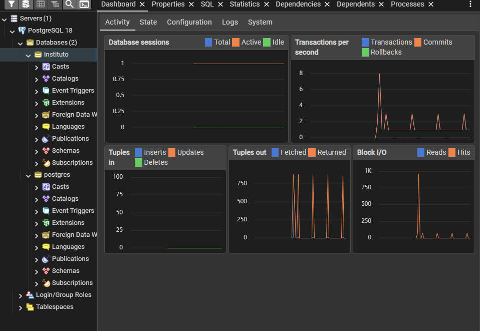
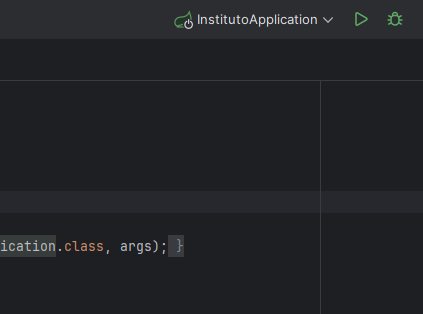
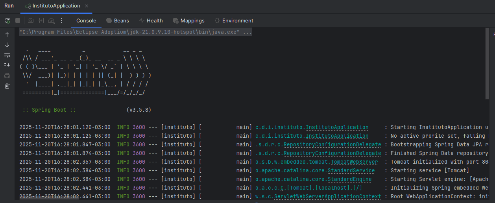
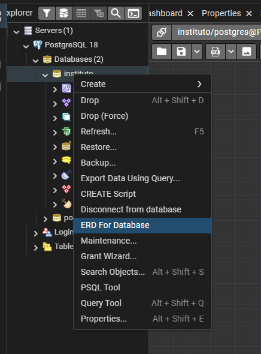
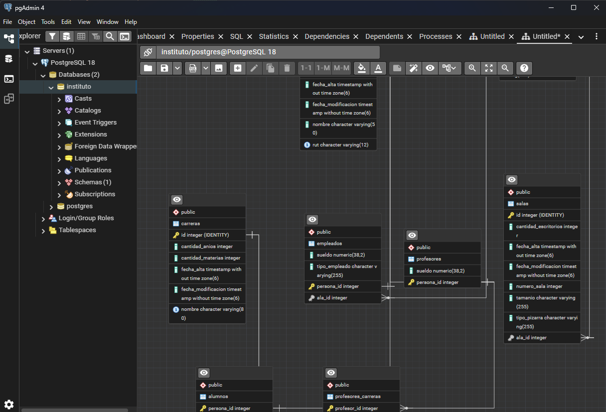
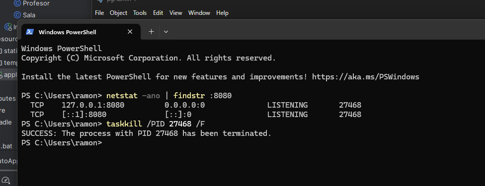

> **Nota:** El codigo final de esta seccion esta disponible en `documentation/parte3_final`. Recuerda agregar las referencias de paquetes correspondientes a tu proyecto (package e imports).

# Decoradores y Relaciones JPA

hasta ahora creamos las entidades con sus atributos, constructores y metodos. ahora vamos a agregar anotaciones para que JPA sepa como convertir estas clases en tablas de base de datos.

## Anotaciones JPA

las anotaciones son como etiquetas que le decimos a JPA "oye, esta clase es una tabla", "este atributo es la clave primaria", "esta columna se llama diferente en la base de datos", etc. son instrucciones para que JPA haga el mapeo automatico.

### Anotaciones que usamos

**@Entity**
- marca una clase como entidad JPA
- le dice a JPA que esta clase debe mapearse a una tabla

**@Table**
- especifica el nombre de la tabla en la base de datos
- ejemplo: `@Table(name = "carreras")`

**@Id**
- marca el atributo como clave primaria de la tabla

**@GeneratedValue**
- indica que el valor del id se genera automaticamente
- `strategy = GenerationType.IDENTITY` usa auto-incremento de la base de datos

**@Column**
- configura como se mapea un atributo a una columna
- `name`: nombre de la columna en la base de datos
- `nullable`: si acepta valores nulos
- `unique`: si debe ser unico
- `length`: tamaño maximo para strings

**@Enumerated**
- indica como guardar un enum en la base de datos
- `EnumType.STRING`: guarda el nombre del enum (ej: "ADMINISTRATIVO")
- `EnumType.ORDINAL`: guarda la posicion numerica (no recomendado)

**@Embedded / @Embeddable**
- permite incluir un objeto dentro de la tabla de otra entidad
- la clase marcada con `@Embeddable` no tiene tabla propia
- se usa para Direccion que se guarda dentro de Persona

**@OneToMany**
- relacion uno a muchos
- ejemplo: un Ala tiene muchas Salas

**@ManyToOne**
- relacion muchos a uno
- ejemplo: muchas Salas pertenecen a un Ala
- crea una foreign key en la tabla

**@ManyToMany**
- relacion muchos a muchos
- ejemplo: Profesores y Carreras
- crea una tabla intermedia automaticamente

**@JoinColumn**
- especifica el nombre de la columna de foreign key
- ejemplo: `@JoinColumn(name = "carrera_id")`

**@PrePersist**
- metodo que se ejecuta antes de insertar en la base de datos
- util para setear fecha de alta automaticamente

**@PreUpdate**
- metodo que se ejecuta antes de actualizar en la base de datos
- util para setear fecha de modificacion automaticamente

### Relaciones entre entidades

segun nuestras reglas de negocio, las entidades tienen las siguientes relaciones:

**Carrera con Alumno:**
- una carrera puede tener muchos alumnos
- un alumno pertenece a una carrera
- relacion: OneToMany (Carrera) / ManyToOne (Alumno)

**Carrera con Profesor:**
- una carrera puede tener muchos profesores
- un profesor puede enseñar en varias carreras
- relacion: ManyToMany

**Ala con Sala:**
- un ala puede tener muchas salas
- una sala pertenece a un ala
- relacion: OneToMany (Ala) / ManyToOne (Sala)

**Ala con Empleado:**
- un ala puede tener muchos empleados
- un empleado puede estar asignado a un ala
- relacion: OneToMany (Ala) / ManyToOne (Empleado)

**Persona con Direccion:**
- una persona tiene una direccion
- la direccion se embebe en la tabla de persona (no tiene tabla propia)
- relacion: @Embedded / @Embeddable

## 1. Anotaciones en Sala

vamos a agregar las anotaciones JPA a la entidad Sala. recordar que Sala tiene una relacion ManyToOne con Ala (muchas salas pertenecen a un ala).

### Anotaciones de clase

agregar sobre la declaracion de la clase:

```java
@Entity
@Table(name = "salas")
public class Sala implements Serializable {
```

- `@Entity`: marca la clase como entidad JPA
- `@Table(name = "salas")`: especifica que la tabla se llama "salas" en la base de datos

### Anotaciones de atributos

```java
// clave primaria auto-incremental
@Id
@GeneratedValue(strategy = GenerationType.IDENTITY)
private Integer id;

// numero de sala obligatorio
@Column(name = "numero_sala", nullable = false)
private Integer numero;

// resto de columnas
@Column(name = "tamanio")
private String tamanio;

@Column(name = "cantidad_escritorios")
private Integer cantidadEscritorios;

// guarda el enum como texto en la base de datos (ej: "DIGITAL", "NORMAL")
@Column(name = "tipo_pizarra")
@Enumerated(EnumType.STRING)
private TipoPizarra tipoPizarra;

@Column(name = "fecha_alta")
private LocalDateTime fechaAlta;

@Column(name = "fecha_modificacion")
private LocalDateTime fechaModificacion;
```

### Relacion con Ala

usamos @ManyToOne porque muchas salas pueden pertenecer a un ala.

```java
// muchas salas pertenecen a un ala
// optional: una sala puede no tener ala asignada
// cascade: propaga operaciones de guardado y actualizacion
@ManyToOne(
        optional = true,
        cascade = {
                CascadeType.MERGE,
                CascadeType.PERSIST
        }
)
```

usamos @JoinColumn para especificar el nombre de la columna que hace referencia al ala.

```java
// columna foreign key y nombre de la constraint
@JoinColumn(
        name = "ala_id",
        foreignKey = @ForeignKey(name = "FK_ALA_ID")
)
private Ala ala;
```

### Getter y Setter de Ala

agregar los metodos getter y setter para el atributo ala:

```java
public Ala getAla() {
    return ala;
}

public void setAla(Ala ala) {
    this.ala = ala;
}
```

### Metodos de ciclo de vida

ahora vamos a crear la logica de automatizacion de obtencion de hora y fecha, pero para eso debemos hacer lo siguiente:

en vez de hacer en la logica los llamados a LocalDateTime.now(), usamos estos decoradores para poder automatizar el cuando fue creado y cuando fue modificado.

abajo de los getters y setters, agregar estos metodos:

```java
@PrePersist
private void antesDePersistir(){
    this.fechaAlta = LocalDateTime.now();
}

@PreUpdate
private void antesDeUpdate(){
    this.fechaModificacion = LocalDateTime.now();
}
```

## 2. Anotaciones en Direccion

la clase Direccion no es una entidad independiente, sino que se embebe dentro de la tabla Persona. esto significa que Direccion no tendra su propia tabla, sus columnas se agregan directamente a la tabla de personas.

usamos @Embeddable porque queremos que los datos de direccion se guarden en la misma tabla que Persona, sin crear una tabla separada ni relaciones entre tablas.

### Anotacion de clase

```java
@Embeddable
public class Direccion implements Serializable {
```

## 3. Anotaciones en Ala

vamos a agregar las anotaciones JPA a la entidad Ala. recordar que Ala tiene una relacion OneToMany con Sala (un ala tiene muchas salas).

### Anotaciones de clase

agregar sobre la declaracion de la clase:

```java
@Entity
@Table(name = "alas")
public class Ala implements Serializable {
```

### Anotaciones de atributos

```java
// clave primaria auto-incremental
@Id
@GeneratedValue(strategy = GenerationType.IDENTITY)
private Integer id;

// resto de columnas
@Column(name = "cantidad_pisos")
private Integer cantidadPisos;

// nombre de ala unico y obligatorio
@Column(name = "nombre_ala", unique = true, nullable = false)
private String nombre;

@Column(name = "fecha_alta")
private LocalDateTime fechaAlta;

@Column(name = "fecha_modificacion")
private LocalDateTime fechaModificacion;
```

### Relacion con Sala

usamos @OneToMany porque un ala puede tener muchas salas.

usamos fetch LAZY (carga perezosa) como buena practica para no traer todas las salas cuando consultamos un ala. las salas solo se cargan de la base de datos cuando realmente las necesitamos, reduciendo la carga y mejorando el rendimiento.

```java
// un ala tiene muchas salas
// mappedBy: indica que Sala tiene el atributo "ala" que maneja la relacion
// fetch LAZY: las salas se cargan solo cuando se necesitan
// cascade MERGE: propaga operaciones de actualizacion
@OneToMany(
        mappedBy = "ala",
        fetch = FetchType.LAZY,
        cascade = CascadeType.MERGE
)
private Set<Sala> salas;
```

### Getter y Setter de Salas

usamos Set porque en relaciones OneToMany queremos una coleccion sin elementos duplicados.

agregar los metodos getter y setter para el atributo salas:

```java
public Set<Sala> getSalas() {
    return salas;
}

public void setSalas(Set<Sala> salas) {
    this.salas = salas;
}
```

### Metodos de ciclo de vida

igual que en Sala, agregamos los metodos de ciclo de vida.

abajo de los getters y setters, agregar estos metodos:

```java
@PrePersist
private void antesDePersistir(){
    this.fechaAlta = LocalDateTime.now();
}

@PreUpdate
private void antesDeUpdate(){
    this.fechaModificacion = LocalDateTime.now();
}
```

## 4. Anotaciones en Carrera

vamos a agregar las anotaciones JPA a la entidad Carrera. recordar que Carrera tiene relacion OneToMany con Alumno y ManyToMany con Profesor.

### Anotaciones de clase

agregar sobre la declaracion de la clase:

```java
@Entity
@Table(name = "carreras")
public class Carrera implements Serializable {
```

### Anotaciones de atributos

```java
// clave primaria auto-incremental
@Id
@GeneratedValue(strategy = GenerationType.IDENTITY)
private Integer id;

// nombre unico, obligatorio y con longitud maxima de 80 caracteres
@Column(nullable = false, unique = true, length = 80)
private String nombre;

// resto de columnas
@Column(name = "cantidad_materias")
private Integer cantidadMaterias;

@Column(name = "cantidad_anios")
private Integer cantidadAnios;

@Column(name = "fecha_alta")
private LocalDateTime fechaAlta;

@Column(name = "fecha_modificacion")
private LocalDateTime fechaModificacion;
```

### Relacion con Alumno

usamos @OneToMany porque una carrera puede tener muchos alumnos.

usamos fetch LAZY (carga perezosa) como buena practica para no traer todos los alumnos cuando consultamos una carrera.

```java
// una carrera tiene muchos alumnos
// mappedBy: indica que Alumno tiene el atributo "carrera" que maneja la relacion
// fetch LAZY: los alumnos se cargan solo cuando se necesitan
@OneToMany(
        mappedBy = "carrera",
        fetch = FetchType.LAZY
)
private Set<Alumno> alumnos;
```

### Relacion con Profesor

usamos @ManyToMany porque una carrera puede tener muchos profesores y un profesor puede enseñar en muchas carreras.

```java
// muchos profesores pueden enseñar en muchas carreras
// mappedBy: indica que Profesor tiene el atributo "carreras" que maneja la relacion
// fetch LAZY: los profesores se cargan solo cuando se necesitan
@ManyToMany(
        mappedBy = "carreras",
        fetch = FetchType.LAZY
)
private Set<Profesor> profesores;
```

### Getter y Setter de Alumnos

usamos Set porque en relaciones OneToMany queremos una coleccion sin elementos duplicados.

agregar los metodos getter y setter para el atributo alumnos:

```java
public Set<Alumno> getAlumnos() {
    return alumnos;
}

public void setAlumnos(Set<Alumno> alumnos) {
    this.alumnos = alumnos;
}
```

### Getter y Setter de Profesores

usamos Set porque en relaciones ManyToMany queremos una coleccion sin elementos duplicados.

agregar los metodos getter y setter para el atributo profesores:

```java
public Set<Profesor> getProfesores() {
    return profesores;
}

public void setProfesores(Set<Profesor> profesores) {
    this.profesores = profesores;
}
```

### Metodos de ciclo de vida

igual que en Sala, agregamos los metodos de ciclo de vida.

abajo de los getters y setters, agregar estos metodos:

```java
@PrePersist
private void antesDePersistir(){
    this.fechaAlta = LocalDateTime.now();
}

@PreUpdate
private void antesDeUpdate(){
    this.fechaModificacion = LocalDateTime.now();
}
```

## 5. Anotaciones en Persona

Persona es la clase padre de Alumno, Profesor y Empleado. como usamos herencia, necesitamos decirle a JPA como manejar las tablas de las clases hijas.

### Anotaciones de clase

```java
@Entity
@Table(name = "personas")
@Inheritance(strategy = InheritanceType.JOINED)
public abstract class Persona implements Serializable {
```



*estrategias de herencia en JPA*

### Estrategias de herencia

JPA tiene tres estrategias para manejar herencia:

**JOINED**
- crea una tabla con los datos comunes y una tabla separada por cada clase hija
- mas normalizado y flexible, permite tener restricciones en cada tabla
- lo malo: para consultar siempre hace join con la tabla padre

**SINGLE_TABLE**
- una sola tabla con todos los atributos de todas las clases
- mejor rendimiento porque no hace joins
- lo malo: los atributos de las clases hijas deben permitir nulos, si tenemos restricciones NOT NULL en hijos, no podemos usarlo

**TABLE_PER_CLASS**
- una tabla completa por cada clase, incluyendo los atributos heredados
- no recomendado porque genera redundancia de datos
- cada tabla repite los atributos del padre

nosotros usamos JOINED porque queremos tablas normalizadas y poder tener restricciones en cada clase hija.

### Anotaciones de atributos

```java
// clave primaria auto-incremental
@Id
@GeneratedValue(strategy = GenerationType.IDENTITY)
private Integer id;

@Column(nullable = false, length = 50)
private String nombre;

@Column(nullable = false, length = 50)
private String apellido;

// rut unico y obligatorio
@Column(nullable = false, unique = true, length = 12)
private String rut;

@Column(name = "fecha_alta")
private LocalDateTime fechaAlta;

@Column(name = "fecha_modificacion")
private LocalDateTime fechaModificacion;

// embebe los atributos de Direccion en esta tabla
// usamos AttributeOverrides para personalizar los nombres de las columnas
@Embedded
@AttributeOverrides({
        @AttributeOverride(name = "calle", column = @Column(name = "direccion_calle")),
        @AttributeOverride(name = "numero", column = @Column(name = "direccion_numero")),
        @AttributeOverride(name = "codigoPostal", column = @Column(name = "direccion_codigo_postal")),
        @AttributeOverride(name = "departamento", column = @Column(name = "direccion_departamento")),
        @AttributeOverride(name = "piso", column = @Column(name = "direccion_piso")),
        @AttributeOverride(name = "localidad", column = @Column(name = "direccion_localidad"))
})
private Direccion direccion;
```

`@Embedded` incluye los atributos de Direccion directamente en la tabla personas. usamos `@AttributeOverrides` para personalizar los nombres de las columnas, agregando el prefijo "direccion_" para que quede claro que pertenecen a la direccion.

### Metodos de ciclo de vida

despues de los getters y setters, agregar estos metodos:

```java
@PrePersist
private void antesDePersistir(){
    this.fechaAlta = LocalDateTime.now();
}

@PreUpdate
private void antesDeUpdate(){
    this.fechaModificacion = LocalDateTime.now();
}
```

## 6. Anotaciones en Empleado

Empleado hereda de Persona. como usamos la estrategia JOINED, necesitamos indicar cual es la columna que une la tabla empleados con la tabla personas.

### Anotaciones de clase

```java
@Entity
@Table(name = "empleados")
@PrimaryKeyJoinColumn(name = "persona_id")
public class Empleado extends Persona {
```

`@PrimaryKeyJoinColumn` indica el nombre de la columna foreign key que conecta empleados con personas. esta columna sera la clave primaria de empleados y a la vez foreign key hacia personas.

### Anotaciones de atributos

```java
private BigDecimal sueldo;

@Column(name = "tipo_empleado")
@Enumerated(EnumType.STRING)
private TipoEmpleado tipo;
```



*estrategias de @Enumerated*

### Estrategia de @Enumerated

`@Enumerated` indica como guardar el enum en la base de datos:

**EnumType.STRING**
- guarda el nombre del enum como texto (ej: "ADMINISTRATIVO", "MANTENIMIENTO")
- recomendado porque si cambias el orden de los valores del enum, no se rompe la base de datos

**EnumType.ORDINAL**
- guarda la posicion numerica (0, 1, 2...)
- no recomendado porque si agregas o reordenas valores, los datos existentes quedan mal

nosotros usamos STRING para que los datos sean legibles y no dependan del orden.

### Relacion con Ala

usamos @ManyToOne porque muchos empleados pueden estar asignados a un ala.

```java
@ManyToOne(
        optional = true,
        cascade = CascadeType.ALL
)
@JoinColumn(
        name = "ala_id",
        foreignKey = @ForeignKey(name = "FK_ALA_ID")
)
private Ala ala;
```

- `optional = true`: un empleado puede no tener ala asignada
- `cascade = CascadeType.ALL`: propaga todas las operaciones (guardar, actualizar, eliminar)

### Getter y Setter de Ala

```java
public Ala getAla() {
    return ala;
}

public void setAla(Ala ala) {
    this.ala = ala;
}
```

### toString

usamos `super.toString()` para incluir los datos de Persona (nombre, apellido, rut, etc.) y agregamos `\t` (tab) para separar visualmente los datos del hijo.

```java
@Override
public String toString() {
    return super.toString() +
            "\tEmpleado{" +
            "sueldo=" + sueldo +
            ", tipo=" + tipo +
            '}';
}
```

## 7. Anotaciones en Profesor

Profesor hereda de Persona. igual que Empleado, usamos @PrimaryKeyJoinColumn para indicar la columna que une la tabla profesores con personas.

### Anotaciones de clase

```java
@Entity
@Table(name = "profesores")
@PrimaryKeyJoinColumn(name = "persona_id")
public class Profesor extends Persona {
```

### Anotaciones de atributos

```java
private BigDecimal sueldo;
```

### Relacion con Carrera

usamos @ManyToMany porque un profesor puede enseñar en muchas carreras y una carrera puede tener muchos profesores.

como saben, en bases de datos cuando hay una relacion many to many se debe crear una tabla intermedia. es lo que haremos ahora con @JoinTable.

```java
@ManyToMany(
        fetch = FetchType.LAZY,
        cascade = {
                CascadeType.PERSIST,
                CascadeType.MERGE
        }
)
// @JoinTable crea una tabla intermedia para la relacion muchos a muchos
// name: nombre de la tabla intermedia
// joinColumns: columna que referencia a esta entidad (profesor)
// inverseJoinColumns: columna que referencia a la otra entidad (carrera)
@JoinTable(
        name = "profesores_carreras",
        joinColumns = @JoinColumn(name = "profesor_id"),
        inverseJoinColumns = @JoinColumn(name = "carrera_id")
)
private Set<Carrera> carreras;
```

### Getter y Setter de Carreras

usamos Set porque no queremos carreras duplicadas y no nos importa el orden. Set usa equals y hashCode para detectar duplicados, por eso agregamos esos metodos en las entidades.

```java
public Set<Carrera> getCarreras() {
    return carreras;
}

public void setCarreras(Set<Carrera> carreras) {
    this.carreras = carreras;
}
```

### toString

usamos `super.toString()` para incluir los datos de Persona y `\t` (tab) para separar visualmente los datos del hijo.

```java
@Override
public String toString() {
    return super.toString() +
            "\tProfesor{" +
            "sueldo=" + sueldo +
            '}';
}
```

## 8. Anotaciones en Alumno

Alumno hereda de Persona. igual que Empleado y Profesor, usamos @PrimaryKeyJoinColumn para indicar la columna que une la tabla alumnos con personas.

### Anotaciones de clase

```java
@Entity
@Table(name = "alumnos")
@PrimaryKeyJoinColumn(name = "persona_id")
public class Alumno extends Persona {
```

### Relacion con Carrera

usamos @ManyToOne porque muchos alumnos pertenecen a una carrera.

```java
// muchos alumnos pertenecen a una carrera
// optional: un alumno puede no tener carrera asignada
// fetch LAZY: la carrera se carga solo cuando se necesita
// cascade PERSIST: si guardas un alumno nuevo, tambien guarda la carrera si es nueva
// cascade MERGE: si actualizas un alumno, tambien actualiza la carrera
@ManyToOne(
        optional = true,
        fetch = FetchType.LAZY,
        cascade = {
                CascadeType.PERSIST,
                CascadeType.MERGE
        }
)
@JoinColumn(name = "carrera_id")
private Carrera carrera;
```

### Getter y Setter de Carrera

```java
public Carrera getCarrera() {
    return carrera;
}

public void setCarrera(Carrera carrera) {
    this.carrera = carrera;
}
```

### toString

como Alumno no tiene atributos propios, solo usamos super.toString() para mostrar los datos de Persona.

```java
@Override
public String toString() {
    return super.toString();
}
```

## 9. Carrera - Continuacion

ahora que ya definimos las relaciones en Alumno y Profesor, volvemos a Carrera para agregar el otro lado de las relaciones.

### Relacion con Alumno

usamos @OneToMany porque una carrera tiene muchos alumnos.

```java
// una carrera tiene muchos alumnos
// mappedBy: indica que Alumno tiene el atributo "carrera" que maneja la relacion
// fetch LAZY: los alumnos se cargan solo cuando se necesitan
@OneToMany(
        mappedBy = "carrera",
        fetch = FetchType.LAZY
)
private Set<Alumno> alumnos;
```

### Relacion con Profesor

usamos @ManyToMany porque una carrera tiene muchos profesores y un profesor puede enseñar en muchas carreras.

```java
// muchos profesores pueden enseñar en muchas carreras
// mappedBy: indica que Profesor tiene el atributo "carreras" que maneja la relacion
// fetch LAZY: los profesores se cargan solo cuando se necesitan
@ManyToMany(
        mappedBy = "carreras",
        fetch = FetchType.LAZY
)
private Set<Profesor> profesores;
```

`mappedBy` indica que la otra entidad es la dueña de la relacion y tiene el @JoinColumn o @JoinTable.

### Getters y Setters

```java
public Set<Alumno> getAlumnos() {
    return alumnos;
}

public void setAlumnos(Set<Alumno> alumnos) {
    this.alumnos = alumnos;
}

public Set<Profesor> getProfesores() {
    return profesores;
}

public void setProfesores(Set<Profesor> profesores) {
    this.profesores = profesores;
}
```

## 10. Crear base de datos en PostgreSQL

ahora que tenemos todas las entidades con sus anotaciones JPA, vamos a crear la base de datos donde se generaran las tablas.

### Abrir pgAdmin

1. abrir pgAdmin desde el menu de inicio o buscador
2. conectarse al servidor PostgreSQL local
3. click derecho en "Databases" > "Create" > "Database..."



*crear nueva base de datos en pgAdmin*

### Crear base de datos instituto

en el dialogo de creacion, ingresar el nombre de la base de datos: `instituto`



*base de datos instituto*

click en "Save" para crear la base de datos.

una vez creada, la base de datos aparecera en el arbol de navegacion:



*base de datos instituto creada*

## 11. Ejecutar la aplicacion

una vez que pgAdmin esta corriendo y la base de datos esta creada (recuerda revisar el archivo `application.properties` visto en el archivo 2), es momento de ejecutar la aplicacion para que JPA cree las tablas automaticamente.

### Ejecutar desde IntelliJ

ir a la clase principal de la aplicacion:

```
src/main/java/com/duoc/institutio/instituto_backend/InstitutoBackendApplication.java
```

click derecho en la clase > Run, o usar el boton de play verde:



*ejecutar la aplicacion desde IntelliJ*

si todo esta configurado correctamente, la aplicacion se iniciara y JPA creara las tablas en la base de datos segun las anotaciones que definimos en las entidades.

### Consola de ejecucion

al ejecutar, veras en la consola de IntelliJ los logs de Spring Boot iniciando:



*consola mostrando la ejecucion de Spring Boot*

en los logs podras ver las consultas SQL que JPA ejecuta para crear las tablas (gracias a `spring.jpa.show-sql=true` en application.properties).

### Verificar tablas en PostgreSQL

una vez que la aplicacion se haya ejecutado correctamente, verifica que las tablas se crearon en PostgreSQL:

1. abre pgAdmin
2. navega a la base de datos `instituto`
3. expande Schemas > public > Tables

deberias ver las tablas creadas: personas, alumnos, profesores, empleados, carreras, salas, alas, profesores_carreras.

para ver el diagrama entidad-relacion, click derecho en Tables > ERD For Database:



*diagrama entidad-relacion generado por pgAdmin*

en el diagrama podras ver no solo las tablas, sino tambien las relaciones entre ellas (foreign keys):



*diagrama mostrando tablas y sus relaciones*

esto confirma que JPA creo correctamente la estructura de la base de datos segun las anotaciones que definimos en las entidades.

## 12. Solucion: puerto 8080 ocupado

si al ejecutar la aplicacion te aparece este error:

```
***************************
APPLICATION FAILED TO START
***************************

Description:

Web server failed to start. Port 8080 was already in use.

Action:

Identify and stop the process that's listening on port 8080 or configure this application to listen on another port.
```

significa que hay un proceso usando el puerto 8080. para solucionarlo:

### Buscar el proceso

abre PowerShell y ejecuta:

```powershell
netstat -ano | findstr :8080
```

esto te mostrara el PID (Process ID) del proceso que esta usando el puerto.

### Matar el proceso

una vez que tengas el PID, ejecuta:

```powershell
taskkill /PID [numero] /F
```

por ejemplo, si el PID es 27468:

```powershell
taskkill /PID 27468 /F
```



*matando el proceso que ocupa el puerto 8080*

luego vuelve a ejecutar la aplicacion.
