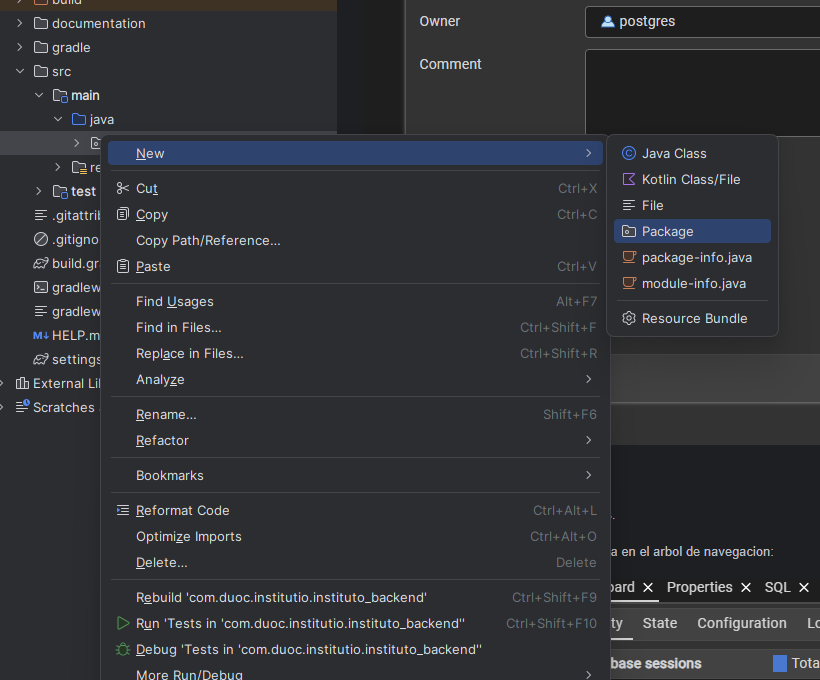
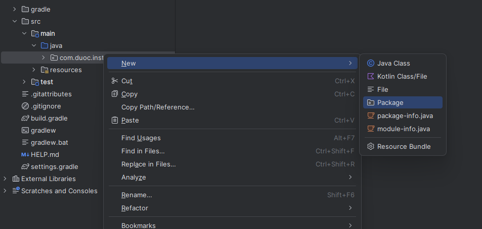
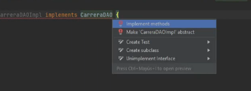
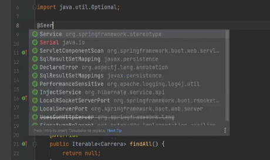
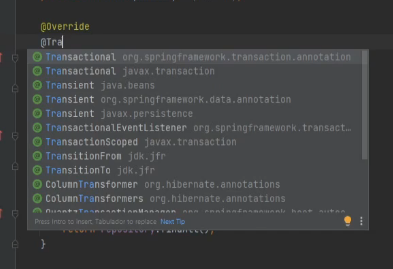
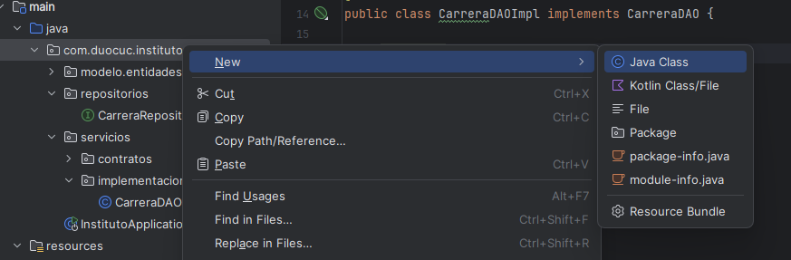
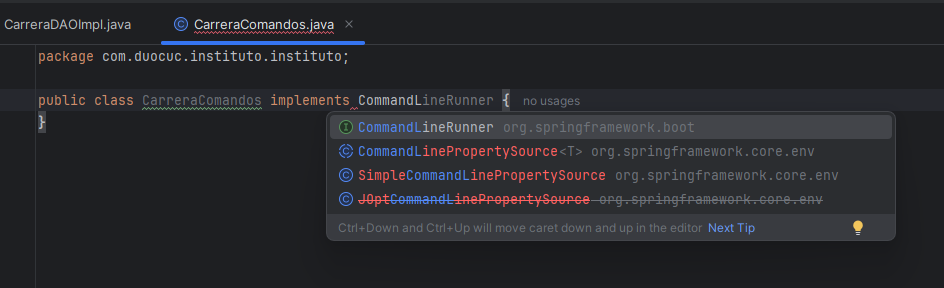
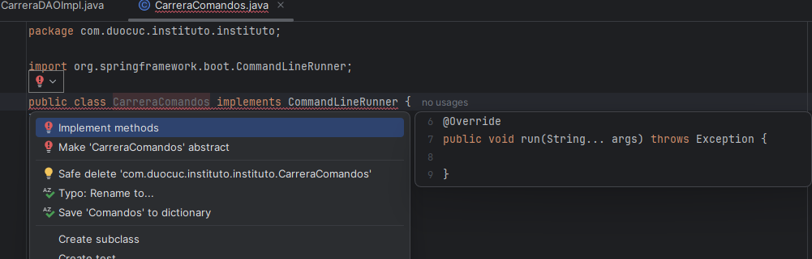
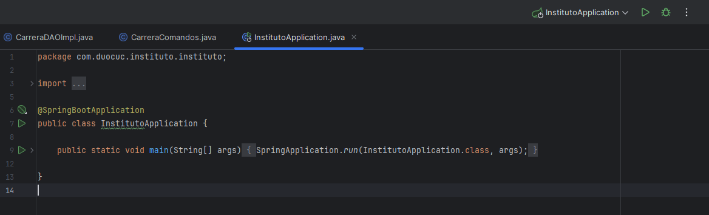
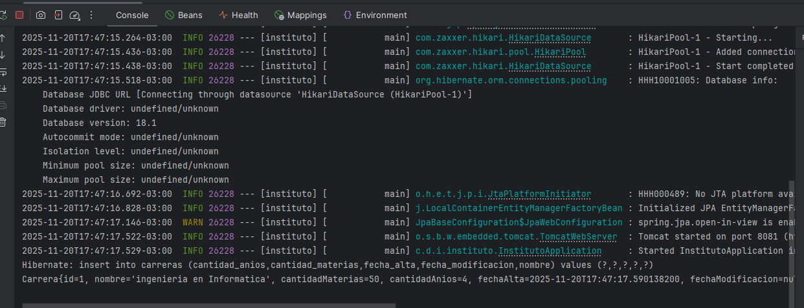

> **Nota:** El codigo final de esta seccion esta disponible en `documentation/parte4_final`. Recuerda agregar las referencias de paquetes correspondientes a tu proyecto (package e imports).

# Repositorios

ahora que tenemos las entidades con sus anotaciones JPA y la base de datos creada, vamos a crear los repositorios para poder hacer operaciones CRUD (crear, leer, actualizar, eliminar) en la base de datos.

## Que es un repositorio

un repositorio es una interfaz que nos permite acceder a los datos de la base de datos sin escribir SQL. Spring Data JPA nos da metodos como save(), findById(), findAll(), delete(), etc. de forma automatica.

## 1. Crear package repositorios

primero creamos el package donde van a estar todos los repositorios.

click derecho en el package principal > New > Package



*crear package repositorios*

## 2. Crear CarreraRepository

dentro del package repositorios, creamos una nueva interfaz llamada CarreraRepository.

```java
package com.duoc.institutio.instituto_backend.repositorios;

import com.duoc.institutio.instituto_backend.modelo.entidades.Carrera;
import org.springframework.data.repository.CrudRepository;

public interface CarreraRepository extends CrudRepository<Carrera, Integer> {
}
```

**importante:** a CrudRepository le pasamos dos parametros genericos:
- `Carrera`: la entidad con la que trabaja este repositorio
- `Integer`: el tipo de dato del id de esa entidad

### Por que extendemos de CrudRepository

CrudRepository es una interfaz de Spring Data que ya tiene los metodos basicos para trabajar con la base de datos:
- `save()`: guardar o actualizar
- `findById()`: buscar por id
- `findAll()`: obtener todos
- `delete()`: eliminar
- `count()`: contar registros
- `existsById()`: verificar si existe

al extender de CrudRepository no necesitamos escribir estos metodos, Spring los implementa automaticamente.

### Diferencia con PagingAndSortingRepository

Spring Data tambien tiene PagingAndSortingRepository que extiende de CrudRepository. esta interfaz cuenta con metodos para paginacion y ordenamiento de registros:
- paginacion: dividir resultados en paginas (ej: 10 registros por pagina)
- ordenamiento: ordenar por cualquier campo

usamos CrudRepository porque es mas simple y no necesitamos paginacion por ahora. si mas adelante necesitas mostrar datos en paginas, puedes cambiar a PagingAndSortingRepository.

### JpaRepository

tambien existe JpaRepository que tiene metodos puramente relacionados con JPA como flush(), saveAndFlush(), deleteInBatch(), etc.

la jerarquia de herencia es:
- CrudRepository (metodos CRUD basicos)
  - PagingAndSortingRepository (agrega paginacion y ordenamiento)
    - JpaRepository (agrega metodos especificos de JPA)

cada uno extiende del anterior, asi que JpaRepository tiene todos los metodos de los tres.

## 3. Crear servicios e implementaciones

para usar el repositorio de Carrera vamos a crear los siguientes packages:
- `servicios`: package principal de servicios
- `servicios.contratos`: donde van las interfaces de los servicios
- `servicios.implementaciones`: donde van las clases que implementan esos servicios

click derecho en el package principal > New > Package

crear el package `servicios` y dentro de este crear los subpackages `contratos` e `implementaciones`.



*packages servicios e implementaciones*

## 4. Crear CarreraDAO

en el package `contratos` vamos a crear la interfaz CarreraDAO. recuerden de POO que las interfaces son contratos que definen que metodos debe tener una clase, pero no como implementarlos.

DAO significa Data Access Object, es un patron de diseño que separa la logica de acceso a datos del resto de la aplicacion.

```java
package com.duoc.institutio.instituto_backend.servicios.contratos;

import com.duoc.institutio.instituto_backend.modelo.entidades.Carrera;
import java.util.Optional;

public interface CarreraDAO {

    // metodo para buscar por id
    Optional<Carrera> findById(Integer id);

    // metodo para guardar un objeto Carrera
    Carrera save(Carrera carrera);

    // metodo para obtener todas las carreras
    Iterable<Carrera> findAll();

    // metodo para eliminar por id
    void deleteById(Integer id);

}
```

usamos `Optional<Carrera>` para encapsular el resultado y evitar NullPointerException. este error ocurre cuando intentamos usar un objeto que es null, y Optional nos obliga a verificar si hay valor antes de usarlo.

## 5. Crear CarreraDAOImpl

en el package `implementaciones` vamos a crear la clase CarreraDAOImpl que implementa CarreraDAO.

```java
package com.duoc.institutio.instituto_backend.servicios.implementaciones;

import com.duoc.institutio.instituto_backend.modelo.entidades.Carrera;
import com.duoc.institutio.instituto_backend.servicios.contratos.CarreraDAO;

import java.util.Optional;

public class CarreraDAOImpl implements CarreraDAO {

}
```

al implementar la interfaz CarreraDAO, el IDE te obliga a implementar todos los metodos del contrato:



*el IDE indica que faltan metodos por implementar*

click en "Implement methods" para generar los metodos:

```java
@Override
public Optional<Carrera> findById(Integer id) {
    return Optional.empty();
}

@Override
public Carrera save(Carrera carrera) {
    return null;
}

@Override
public Iterable<Carrera> findAll() {
    return null;
}

@Override
public void deleteById(Integer id) {

}
```

### Marcar como @Service

para que Spring reconozca esta clase como un servicio, debemos agregar la anotacion @Service:



*agregar @Service a la clase*

```java
@Service
public class CarreraDAOImpl implements CarreraDAO {
```

con @Service, Spring crea automaticamente una instancia de esta clase y la inyecta donde se necesite.

### Inyectar CarreraRepository

ahora inyectamos el repositorio usando el patron de inyeccion de dependencias:

```java
@Autowired
private CarreraRepository repository;
```

`@Autowired` le dice a Spring que busque una instancia de CarreraRepository y la inyecte automaticamente. asi no necesitamos crear el objeto manualmente con new.

### Implementar los metodos

ahora completamos los metodos usando el repositorio:

```java
@Override
@Transactional(readOnly = true)
public Optional<Carrera> findById(Integer id) {
    return repository.findById(id);
}

@Override
@Transactional
public Carrera save(Carrera carrera) {
    return repository.save(carrera);
}

@Override
@Transactional(readOnly = true)
public Iterable<Carrera> findAll() {
    return repository.findAll();
}

@Override
@Transactional
public void deleteById(Integer id) {
    repository.deleteById(id);
}
```

cada metodo simplemente llama al metodo correspondiente del repositorio. el repositorio se encarga de la comunicacion con la base de datos.

### Agregar @Transactional

como esta clase trabaja con la base de datos, agregamos @Transactional para manejar las transacciones automaticamente:



*importar @Transactional de Spring, no de javax*

```java
@Service
@Transactional
public class CarreraDAOImpl implements CarreraDAO {
```

@Transactional asegura que si algo falla durante una operacion, se hace rollback y la base de datos queda en un estado consistente. importar de `org.springframework.transaction.annotation.Transactional`.

## 6. Crear componente de prueba

como no tenemos una interfaz web todavia, vamos a crear un componente para probar el servicio desde la consola.

### Crear CarreraComandos

crear una nueva clase llamada `CarreraComandos` directamente en el package principal de la aplicacion:



*crear clase CarreraComandos en el package principal*

### Implementar CommandLineRunner

esta clase debe implementar `CommandLineRunner`, que es una interfaz de Spring Boot que se ejecuta automaticamente cuando la aplicacion inicia:



*implementar CommandLineRunner*

```java
@Component
public class CarreraComandos implements CommandLineRunner {

    @Override
    public void run(String... args) throws Exception {
        // aqui va el codigo de prueba
    }
}
```

`@Component` marca la clase para que Spring la detecte y ejecute automaticamente. el metodo `run()` se ejecuta al iniciar la aplicacion.

al implementar CommandLineRunner, el IDE nos marca en rojo porque nos obliga a implementar el metodo `run`:



*el IDE indica que falta implementar el metodo run*

### Instanciar objeto Carrera

dentro del metodo `run()`, vamos a crear una instancia de Carrera para probar el servicio:

```java
@Override
public void run(String... args) throws Exception {
    // instancia nueva
    // primer argumento null, porque es un objeto nuevo
    // segundo argumento nombre de carrera
    // tercer argumento, materias
    // cuarto argumento es cantidad anios
    Carrera ingInformatica = new Carrera(null, "Ingenieria en Informatica", 50, 4);
}
```

el primer argumento es `null` porque el id se genera automaticamente en la base de datos (recordar que usamos `@GeneratedValue` en la entidad).

### Inyectar el servicio

para usar el servicio de Carrera, lo inyectamos usando `@Autowired`:

```java
@Component
public class CarreraComandos implements CommandLineRunner {

    // inyeccion de dependencias
    @Autowired
    private CarreraDAO servicio;

    @Override
    public void run(String... args) throws Exception {

        // instancia nueva
        // primer argumento null, porque es un objeto nuevo
        // segundo argumento nombre de carrera
        // tercer argumento, materias
        // cuarto argumento es cantidad anios
        Carrera ingInformatica = new Carrera(null, "Ingenieria en Informatica", 50, 4);

        // guardar en la base de datos
        Carrera save = servicio.save(ingInformatica);

        // mostrar resultado
        System.out.println(save.toString());
    }
}
```

`@Autowired` le dice a Spring que busque una implementacion de CarreraDAO (que es CarreraDAOImpl) y la inyecte automaticamente. luego usamos `servicio.save()` para guardar la carrera en la base de datos y mostramos el resultado con `toString()`.

### Ejecutar la aplicacion

ahora vamos a la clase principal de la aplicacion y ejecutamos:



*ejecutar la aplicacion desde la clase principal*

### Ver resultado en consola

si todo esta bien configurado, en la consola veremos la ejecucion de nuestro servicio:



*resultado de la ejecucion mostrando la carrera guardada*

deberiamos ver algo como:

```
Carrera{id=1, nombre='Ingenieria en Informatica', cantidadMaterias=50, cantidadAnios=4, fechaAlta=..., fechaModificacion=...}
```

el `id=1` confirma que la carrera se guardo correctamente en la base de datos y JPA le asigno un id automaticamente.
