> **Nota:** El codigo final de esta seccion esta disponible en `documentation/parte4_final`. Recuerda agregar las referencias de paquetes correspondientes a tu proyecto (package e imports).

# Repositorios

ahora que tenemos las entidades con sus anotaciones JPA y la base de datos creada, vamos a crear los repositorios para poder hacer operaciones CRUD (crear, leer, actualizar, eliminar) en la base de datos.

## Que es un repositorio

un repositorio es una interfaz que nos permite acceder a los datos de la base de datos sin escribir SQL. Spring Data JPA nos da metodos como save(), findById(), findAll(), delete(), etc. de forma automatica.

## 1. Crear package repositorios

primero creamos el package donde van a estar todos los repositorios.

click derecho en el package principal > New > Package


*crear package repositorios*

## 2. Crear CarreraRepository

dentro del package repositorios, creamos una nueva interfaz llamada CarreraRepository.

```java
package com.duoc.institutio.instituto_backend.repositorios;

import com.duoc.institutio.instituto_backend.modelo.entidades.Carrera;
import org.springframework.data.repository.CrudRepository;

public interface CarreraRepository extends CrudRepository<Carrera, Integer> {
}
```

**importante:** a CrudRepository le pasamos dos parametros genericos:
- `Carrera`: la entidad con la que trabaja este repositorio
- `Integer`: el tipo de dato del id de esa entidad

### Por que extendemos de CrudRepository

CrudRepository es una interfaz de Spring Data que ya tiene los metodos basicos para trabajar con la base de datos:
- `save()`: guardar o actualizar
- `findById()`: buscar por id
- `findAll()`: obtener todos
- `delete()`: eliminar
- `count()`: contar registros
- `existsById()`: verificar si existe

al extender de CrudRepository no necesitamos escribir estos metodos, Spring los implementa automaticamente.

### Diferencia con PagingAndSortingRepository

Spring Data tambien tiene PagingAndSortingRepository que extiende de CrudRepository. esta interfaz cuenta con metodos para paginacion y ordenamiento de registros:
- paginacion: dividir resultados en paginas (ej: 10 registros por pagina)
- ordenamiento: ordenar por cualquier campo

usamos CrudRepository porque es mas simple y no necesitamos paginacion por ahora. si mas adelante necesitas mostrar datos en paginas, puedes cambiar a PagingAndSortingRepository.

### JpaRepository

tambien existe JpaRepository que tiene metodos puramente relacionados con JPA como flush(), saveAndFlush(), deleteInBatch(), etc.

la jerarquia de herencia es:
- CrudRepository (metodos CRUD basicos)
  - PagingAndSortingRepository (agrega paginacion y ordenamiento)
    - JpaRepository (agrega metodos especificos de JPA)

cada uno extiende del anterior, asi que JpaRepository tiene todos los metodos de los tres.

## 3. Crear servicios e implementaciones

para usar el repositorio de Carrera vamos a crear los siguientes packages:
- `servicios`: package principal de servicios
- `servicios.contratos`: donde van las interfaces de los servicios
- `servicios.implementaciones`: donde van las clases que implementan esos servicios

click derecho en el package principal > New > Package

crear el package `servicios` y dentro de este crear los subpackages `contratos` e `implementaciones`.


*packages servicios e implementaciones*

## 4. Crear CarreraDAO

en el package `contratos` vamos a crear la interfaz CarreraDAO. recuerden de POO que las interfaces son contratos que definen que metodos debe tener una clase, pero no como implementarlos.

DAO significa Data Access Object, es un patron de diseño que separa la logica de acceso a datos del resto de la aplicacion.

```java
package com.duoc.institutio.instituto_backend.servicios.contratos;

import com.duoc.institutio.instituto_backend.modelo.entidades.Carrera;
import java.util.Optional;

public interface CarreraDAO {

    // metodo para buscar por id
    Optional<Carrera> findById(Integer id);

    // metodo para guardar un objeto Carrera
    Carrera save(Carrera carrera);

    // metodo para obtener todas las carreras
    Iterable<Carrera> findAll();

    // metodo para eliminar por id
    void deleteById(Integer id);

}
```

usamos `Optional<Carrera>` para encapsular el resultado y evitar NullPointerException. este error ocurre cuando intentamos usar un objeto que es null, y Optional nos obliga a verificar si hay valor antes de usarlo.

## 5. Crear CarreraDAOImpl

en el package `implementaciones` vamos a crear la clase CarreraDAOImpl que implementa CarreraDAO.

```java
package com.duoc.institutio.instituto_backend.servicios.implementaciones;

import com.duoc.institutio.instituto_backend.modelo.entidades.Carrera;
import com.duoc.institutio.instituto_backend.servicios.contratos.CarreraDAO;

import java.util.Optional;

public class CarreraDAOImpl implements CarreraDAO {

}
```

al implementar la interfaz CarreraDAO, el IDE te obliga a implementar todos los metodos del contrato:


*el IDE indica que faltan metodos por implementar*

click en "Implement methods" para generar los metodos:

```java
@Override
public Optional<Carrera> findById(Integer id) {
    return Optional.empty();
}

@Override
public Carrera save(Carrera carrera) {
    return null;
}

@Override
public Iterable<Carrera> findAll() {
    return null;
}

@Override
public void deleteById(Integer id) {

}
```

### Marcar como @Service

para que Spring reconozca esta clase como un servicio, debemos agregar la anotacion @Service:


*agregar @Service a la clase*

```java
@Service
public class CarreraDAOImpl implements CarreraDAO {
```

con @Service, Spring crea automaticamente una instancia de esta clase y la inyecta donde se necesite.

### Inyectar CarreraRepository

ahora inyectamos el repositorio usando el patron de inyeccion de dependencias:

```java
@Autowired
private CarreraRepository repository;
```

`@Autowired` le dice a Spring que busque una instancia de CarreraRepository y la inyecte automaticamente. asi no necesitamos crear el objeto manualmente con new.

### Implementar los metodos

ahora completamos los metodos usando el repositorio:

```java
@Override
@Transactional(readOnly = true)
public Optional<Carrera> findById(Integer id) {
    return repository.findById(id);
}

@Override
@Transactional
public Carrera save(Carrera carrera) {
    return repository.save(carrera);
}

@Override
@Transactional(readOnly = true)
public Iterable<Carrera> findAll() {
    return repository.findAll();
}

@Override
@Transactional
public void deleteById(Integer id) {
    repository.deleteById(id);
}
```

cada metodo simplemente llama al metodo correspondiente del repositorio. el repositorio se encarga de la comunicacion con la base de datos.

### Agregar @Transactional

como esta clase trabaja con la base de datos, agregamos @Transactional para manejar las transacciones automaticamente:


*importar @Transactional de Spring, no de javax*

```java
@Service
@Transactional
public class CarreraDAOImpl implements CarreraDAO {
```

@Transactional asegura que si algo falla durante una operacion, se hace rollback y la base de datos queda en un estado consistente. importar de `org.springframework.transaction.annotation.Transactional`.

## 6. Crear componente de prueba

como no tenemos una interfaz web todavia, vamos a crear un componente para probar el servicio desde la consola.

### Crear CarreraComandos

crear una nueva clase llamada `CarreraComandos` directamente en el package principal de la aplicacion:


*crear clase CarreraComandos en el package principal*

### Implementar CommandLineRunner

esta clase debe implementar `CommandLineRunner`, que es una interfaz de Spring Boot que se ejecuta automaticamente cuando la aplicacion inicia:


*implementar CommandLineRunner*

```java
@Component
public class CarreraComandos implements CommandLineRunner {

    @Override
    public void run(String... args) throws Exception {
        // aqui va el codigo de prueba
    }
}
```

`@Component` marca la clase para que Spring la detecte y ejecute automaticamente. el metodo `run()` se ejecuta al iniciar la aplicacion.

al implementar CommandLineRunner, el IDE nos marca en rojo porque nos obliga a implementar el metodo `run`:


*el IDE indica que falta implementar el metodo run*

### Instanciar objeto Carrera

dentro del metodo `run()`, vamos a crear una instancia de Carrera para probar el servicio:

```java
@Override
public void run(String... args) throws Exception {
    // instancia nueva
    // primer argumento null, porque es un objeto nuevo
    // segundo argumento nombre de carrera
    // tercer argumento, materias
    // cuarto argumento es cantidad anios
    Carrera ingInformatica = new Carrera(null, "Ingenieria en Informatica", 50, 4);
}
```

el primer argumento es `null` porque el id se genera automaticamente en la base de datos (recordar que usamos `@GeneratedValue` en la entidad).

### Inyectar el servicio

para usar el servicio de Carrera, lo inyectamos usando `@Autowired`:

```java
@Component
public class CarreraComandos implements CommandLineRunner {

    // inyeccion de dependencias
    @Autowired
    private CarreraDAO servicio;

    @Override
    public void run(String... args) throws Exception {

        // instancia nueva
        // primer argumento null, porque es un objeto nuevo
        // segundo argumento nombre de carrera
        // tercer argumento, materias
        // cuarto argumento es cantidad anios
        Carrera ingInformatica = new Carrera(null, "Ingenieria en Informatica", 50, 4);

        // guardar en la base de datos
        Carrera save = servicio.save(ingInformatica);

        // mostrar resultado
        System.out.println(save.toString());
    }
}
```

`@Autowired` le dice a Spring que busque una implementacion de CarreraDAO (que es CarreraDAOImpl) y la inyecte automaticamente. luego usamos `servicio.save()` para guardar la carrera en la base de datos y mostramos el resultado con `toString()`.

### Ejecutar la aplicacion

ahora vamos a la clase principal de la aplicacion y ejecutamos:


*ejecutar la aplicacion desde la clase principal*

### Ver resultado en consola

si todo esta bien configurado, en la consola veremos la ejecucion de nuestro servicio:


*resultado de la ejecucion mostrando la carrera guardada*

deberiamos ver algo como:

```
Carrera{id=1, nombre='Ingenieria en Informatica', cantidadMaterias=50, cantidadAnios=4, fechaAlta=..., fechaModificacion=...}
```

el `id=1` confirma que la carrera se guardo correctamente en la base de datos y JPA le asigno un id automaticamente.

## 7. Crear PersonaRepository

ahora que nuestra api funciona de forma exitosa con las pruebas del CommandLineRunner, vamos a crear un nuevo repositorio. esta vez crearemos el de Persona para manejar la herencia.

dentro del package repositorios, crear una nueva interfaz llamada PersonaRepository.

click derecho en el package repositorios > New > Java Class > seleccionar Interface

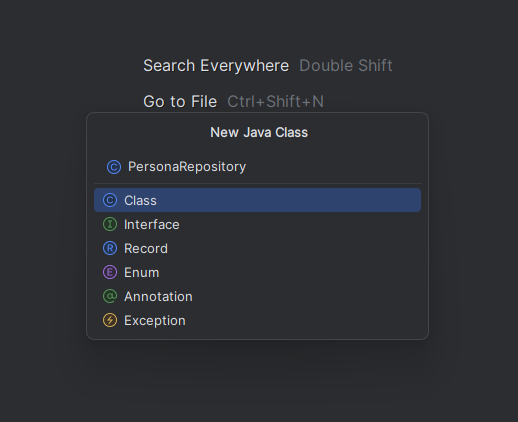

*crear interfaz PersonaRepository*

como en el repository anterior, vamos a usar CrudRepository. como vimos, debemos pasarle dos parametros, la entidad Persona y el id, que es de tipo Integer.

por otro lado, debemos implementar una anotacion llamada `@NoRepositoryBean`, ya que como sabemos, la clase abstracta no puede ser instanciada, ergo, no se va a crear un bean de esto.

```java
package com.duocuc.instituto.instituto.repositorios;

import com.duocuc.instituto.instituto.modelo.entidades.Persona;
import org.springframework.data.repository.CrudRepository;
import org.springframework.data.repository.NoRepositoryBean;

@NoRepositoryBean
public interface PersonaRepository extends CrudRepository<Persona, Integer> {
}
```

## 8. Crear AlumnoRepository

ahora hacemos lo mismo para Alumno, creamos un repositorio para alumno.

click derecho en el package repositorios > New > Java Class > seleccionar Interface

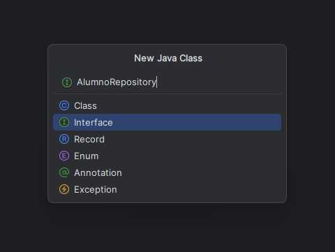

*crear interfaz AlumnoRepository*

como Alumno hereda de Persona, AlumnoRepository extiende de PersonaRepository para aprovechar la herencia.

```java
package com.duocuc.instituto.instituto.repositorios;

import org.springframework.stereotype.Repository;

@Repository("repositorioAlumnos")
public interface AlumnoRepository extends PersonaRepository {
}
```

### Si el puerto 8080 esta ocupado

antes de ejecutar, si te da un error que el puerto este ocupado, puedes ir a ver si el puerto 8080 esta ocupado. para eso, abrimos powershell y escribimos:

```powershell
netstat -ano | findstr :8080
```

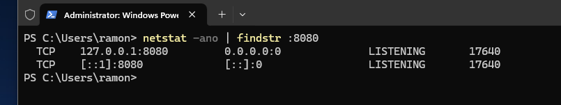

*verificar si el puerto 8080 esta ocupado*

una vez encuentres el error, puedes encontrar el numero PID, en mi caso 17640 en la imagen y matarlo con:

```powershell
taskkill /PID 17640 /F
```

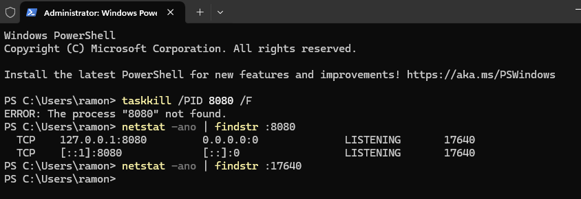

*matar el proceso que ocupa el puerto*

### Opcional: Ver los beans creados

ahora que tenemos los repositorios de Alumno y Persona, podemos ver los beans que Spring crea automaticamente. los beans son objetos gestionados por el contenedor de Spring que se instancian, configuran e inyectan automaticamente donde se necesiten.

si quieres profundizar mas sobre beans, puedes consultar la documentacion oficial de Spring: https://docs.spring.io/spring-framework/reference/core/beans/java/bean-annotation.html

para hacer esto, tenemos que comentar la creacion del objeto Carrera en CarreraComandos, clase para probar y testear nuestros objetos.

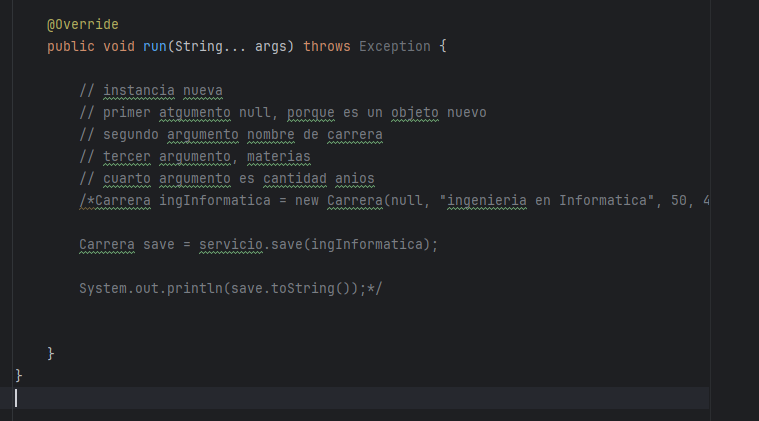

*comentar la creacion del objeto Carrera*

luego en nuestro archivo de ejecucion o entry point, vamos a obtener el contexto de la aplicacion que retorna `SpringApplication.run()`. este contexto tiene el metodo `getBeanDefinitionNames()` que nos devuelve los nombres de todos los beans.

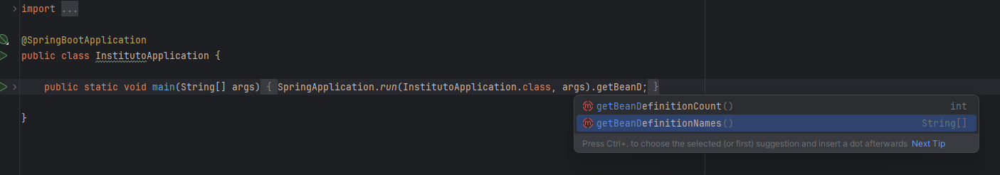

*obtener el contexto de la aplicacion*

para obtener los datos, tenemos que obtenerlos y pasarselos a un Array de tipo String primero.

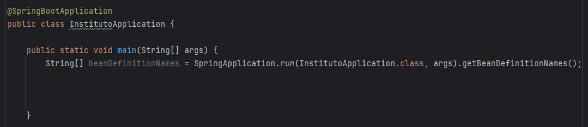

*guardar los nombres de beans en un array de String*

una vez teniendo el array de beans, lo recorremos y los imprimimos en consola.

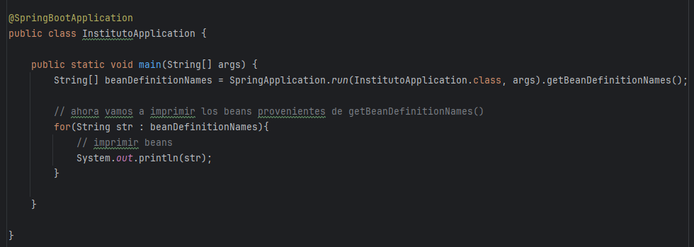

*recorrer e imprimir los beans*

una vez solucionado el problema de 8080 si te pasa a ti, podemos correr la aplicacion y ver que cargan varios archivos, entre ellos beans. entonces con ctrl + f podemos ir a buscar si nuestro repositorioAlumnos fue creado. si todo sale bien, deberias encontrar el bean recien creado. no solo puedes buscar repositorioAlumnos, tambien puedes buscar carreraRepository.

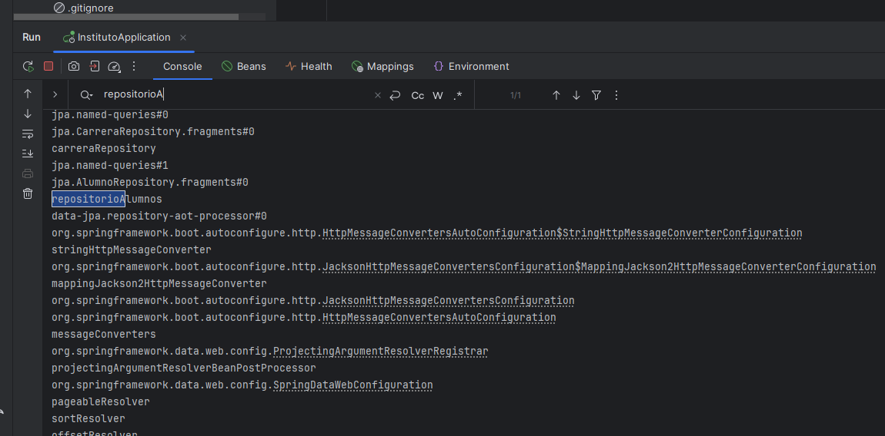

*buscar el bean repositorioAlumnos en la consola*

## 9. Crear AlumnoDAO

una vez validado la forma de poder ver creacion de beans, vamos a crear el servicio para nuestro repositorio alumnos. vamos a crear la interface AlumnoDAO.

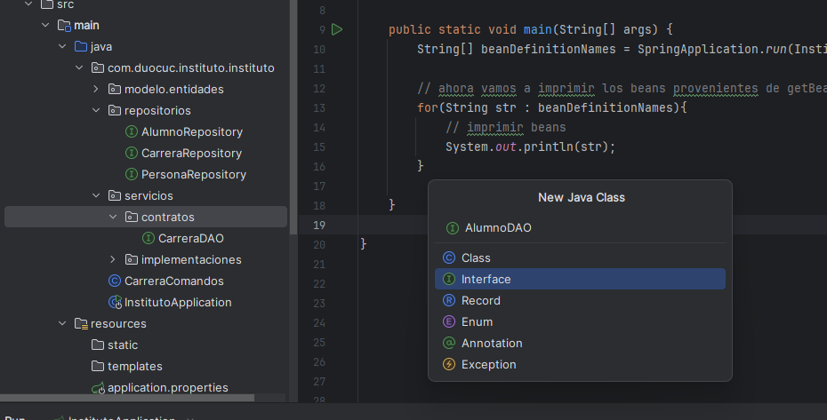

*crear interface AlumnoDAO en el package contratos*

para no tener que hacer todo de nuevo, vamos a tomar los metodos que ya definimos en nuestra clase CarreraDAO y pegarlos en AlumnoDAO. eso si, cambiando las referencias a objetos como Persona, etc, ya que trabajaremos con la clase padre.

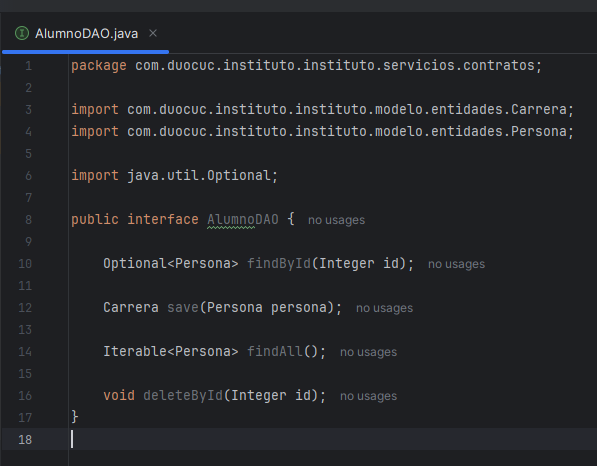

*copiar metodos de CarreraDAO y cambiar referencias a Persona*

```java
package com.duocuc.instituto.instituto.servicios.contratos;

import com.duocuc.instituto.instituto.modelo.entidades.Carrera;
import com.duocuc.instituto.instituto.modelo.entidades.Persona;

import java.util.Optional;

public interface AlumnoDAO {

    Optional<Persona> findById(Integer id);

    Carrera save(Persona persona);

    Iterable<Persona> findAll();

    void deleteById(Integer id);
}
```


## 10. Crear AlumnoDAOImpl

ahora tenemos que crear la clase de implementacion. para eso, vamos a crear la clase AlumnoDAOImpl, implementamos la interface AlumnoDAO y este ultimo nos obliga a implementar los metodos del contrato.

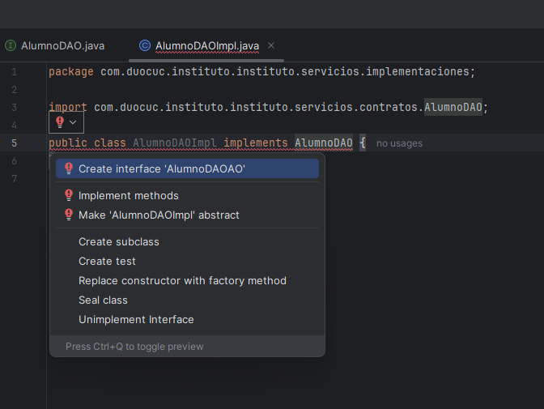

*crear clase AlumnoDAOImpl e implementar AlumnoDAO*

decoramos la clase con @Service para que Spring la reconozca como un servicio. ademas debemos inyectar la dependencia de PersonaRepository con @Autowired.

aca va a haber un problema, porque al tener multiples repositorios que extienden de PersonaRepository (como AlumnoRepository), Spring no sabe cual bean inyectar. para resolver esta ambiguedad, usaremos el decorador @Qualifier y le pasaremos el nombre del bean que corresponde, en este caso "repositorioAlumnos" que definimos en AlumnoRepository.

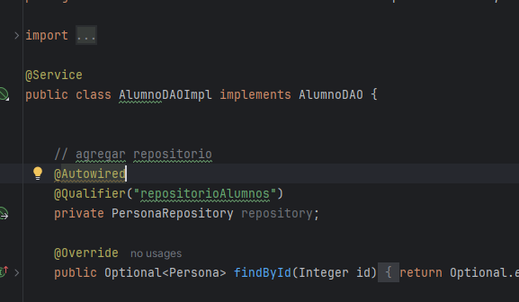

*agregar @Service, @Autowired y @Qualifier a la clase*

@Qualifier recibe como parametro el nombre del bean que definimos con @Repository("repositorioAlumnos") en AlumnoRepository. asi Spring sabe exactamente cual implementacion inyectar.

### Implementar los metodos

ahora empezamos a modificar los metodos de la implementacion. empezamos con findById que simplemente llama al repositorio.

pero si pasamos a save, tendremos un problema. en la interface AlumnoDAO definimos save como que retorna Carrera, y debe ser Persona.

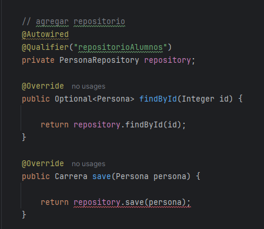

*el metodo save retorna Carrera pero deberia retornar Persona*

nos devolvemos a AlumnoDAO y cambiamos Carrera por Persona en el metodo save. una vez hecho esto, el IDE nos acusara un problema con la actualizacion en otras clases, por lo que le damos click en "Update" para actualizar las implementaciones.

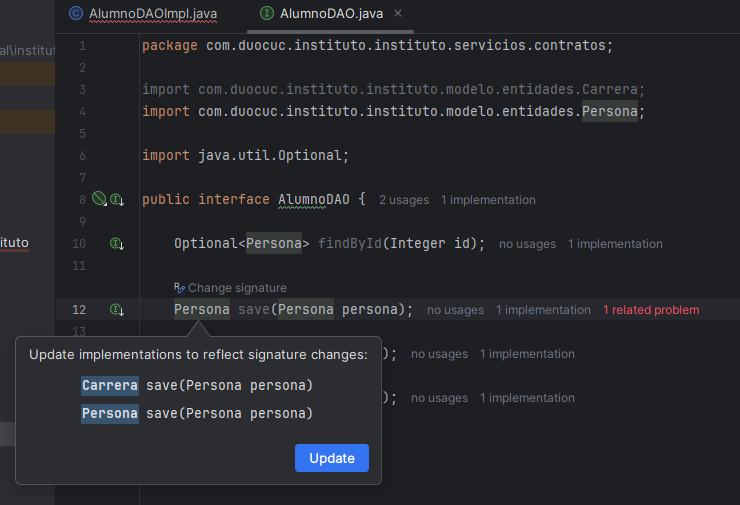

*actualizar las implementaciones para reflejar el cambio de signature*

una vez listo esto, terminamos de implementar los metodos de la implementacion. cada metodo llama al metodo correspondiente del repositorio. ademas agregamos las anotaciones @Transactional a cada metodo.

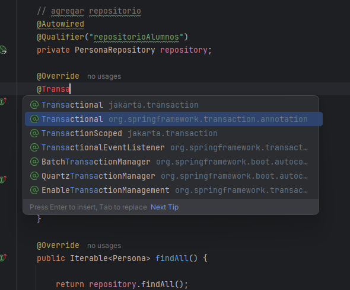

*agregar @Transactional a los metodos, importar de org.springframework.transaction.annotation*

recuerda seleccionar @Transactional de `org.springframework.transaction.annotation` y no de `jakarta.transaction`.

recuerda solo agregar `@Transactional(readOnly = true)` a findById y findAll porque son metodos que solo leen datos y no modifican la base de datos, lo que permite optimizaciones de rendimiento.

este es el codigo final:

```java
package com.duocuc.instituto.instituto.servicios.implementaciones;

import com.duocuc.instituto.instituto.modelo.entidades.Persona;
import com.duocuc.instituto.instituto.repositorios.PersonaRepository;
import com.duocuc.instituto.instituto.servicios.contratos.AlumnoDAO;
import org.springframework.beans.factory.annotation.Autowired;
import org.springframework.beans.factory.annotation.Qualifier;
import org.springframework.stereotype.Service;
import org.springframework.transaction.annotation.Transactional;

import java.util.Optional;

@Service
public class AlumnoDAOImpl implements AlumnoDAO {


    // agregar repositorio
    @Autowired
    @Qualifier("repositorioAlumnos")
    private PersonaRepository repository;

    @Override
    @Transactional(readOnly = true)
    public Optional<Persona> findById(Integer id) {

        return repository.findById(id);
    }

    @Transactional
    @Override
    public Persona save(Persona persona) {

        return repository.save(persona);
    }
    
    @Transactional(readOnly = true)
    @Override
    public Iterable<Persona> findAll() {

        return repository.findAll();
    }
    
    @Transactional
    @Override
    public void deleteById(Integer id) {
        repository.deleteById(id);
    }
}
```

## 11. Probar AlumnoDAOImpl

para no crear un archivo nuevo de comandos, vamos a crear un metodo directo en el main y probar nuestra implementacion. para ello, vamos a comentar el foreach que usamos para buscar los beans generados.

una vez listo, vamos a crear un metodo publico que devuelva el objeto CommandLineRunner pero de tipo lambda. para esto, debemos decorarlo con la anotacion @Bean.

instanciamos a Alumno pero tambien Direccion, ya que Persona lleva implicito Direccion (lo lleva embebido):

```java
// generamos un metodo persona pero de tipo alumno
Direccion direccion = new Direccion("calle1", "1521", "3520225", "30", "20", "Santiago");
Persona alumno = new Alumno(null, "Damian", "Perez", "156624578", direccion);
```

para poder hacer funcionar estos metodos debemos inyectar la dependencia de AlumnoDAO:

```java
@Autowired
private AlumnoDAO servicio;
```

recuerda que con @Autowired inyectamos las dependencias, en este caso el DAO.

ahora que esta listo podemos guardarlo ya que hemos inyectado dependencias con @Autowired y el servicio esta listo:

```java
// una vez inyectado el servicio, guardamos
Persona save = servicio.save(alumno);
```

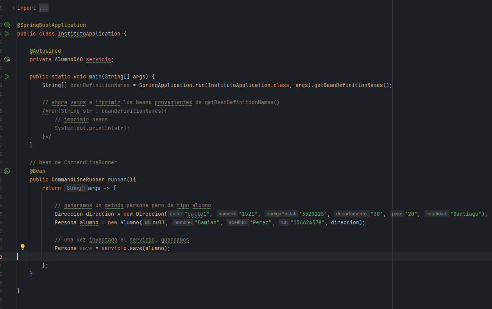

*probar AlumnoDAOImpl desde el entry point*

este es el codigo final:

```java
@SpringBootApplication
public class InstitutoApplication {

    @Autowired
    private AlumnoDAO servicio;

    public static void main(String[] args) {
        String[] beanDefinitionNames = SpringApplication.run(InstitutoApplication.class, args).getBeanDefinitionNames();

        // ahora vamos a imprimir los beans provenientes de getBeanDefinitionNames()
        /*for(String str : beanDefinitionNames){
            // imprimir beans
            System.out.println(str);
        }*/
    }

    // bean de CommandLineRunner
    @Bean
    public CommandLineRunner runner(){
        return args -> {

            // generamos un metodo persona pero de tipo alumno
            Direccion direccion = new Direccion("calle1", "1521", "3520225", "30", "20", "Santiago");
            Persona alumno = new Alumno(null, "Damian", "Perez", "156624578", direccion);

            // una vez inyectado el servicio, guardamos
            Persona save = servicio.save(alumno);

        };
    }

}
```

si todo sale bien, vas a poder ver la insercion dos veces, una en Persona y otra en Alumno. eso es precisamente por el tipo de estrategia que elegimos a la hora de crear nuestras tablas (JOINED).

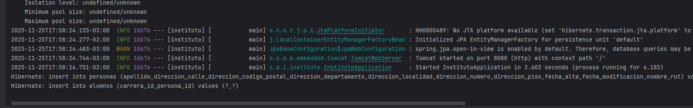

*hibernate ejecuta dos inserts: uno en personas y otro en alumnos*
